# AI Video Production Specialist — Digital FTE

> **Transform narrative briefs into ultra-realistic videos with multi-character Face-Lock consistency, Sacred Guard protection, and enterprise-grade observability.**

[](https://github.com/mhusnain-dev/MY_FTE/actions)
[](https://codecov.io/gh/mhusnain-dev/MY_FTE)
[](https://www.typescriptlang.org/)
[](https://nodejs.org/)

---

## 🎯 What This FTE Does

The **AI Video Production Specialist** is an autonomous Digital FTE (Full-Time Equivalent) that orchestrates the entire video production pipeline:

```
┌─────────────────────────────────────────────────────────────────────────────┐
│                        USER SUBMITS STORY BRIEF                             │
│  { narrative, duration, aspectRatio, characters[], styleRefs, audioConfig } │
└────────────────────────────────┬────────────────────────────────────────────┘
                                 │
                                 ▼
┌─────────────────────────────────────────────────────────────────────────────┐
│  1️⃣  INGESTION & PLANNING                                                    │
│  • Narrative → Structured Shot Plan (visual, duration, camera, characters)  │
│  • User reviews & approves shot plan (or revises)                           │
│  • Character references uploaded → Face detection + Sacred Guard registry   │
└────────────────────────────────┬────────────────────────────────────────────┘
                                 │
                                 ▼
┌─────────────────────────────────────────────────────────────────────────────┐
│  2️⃣  ADMISSION CONTROL PIPELINE                                              │
│  🛡 Moderation → 🛡 Sacred Guard (5 enforcement points)                     │
│  💰 Cost Guard (drift alerts) → ⚡ Rate Limit (per-model/user/global)       │
│  📋 Immutable audit log for every decision                                  │
└────────────────────────────────┬────────────────────────────────────────────┘
                                 │
                                 ▼
┌─────────────────────────────────────────────────────────────────────────────┐
│  3️⃣  MODEL SELECTION & ROUTING                                               │
│  • AUTO: Per-user priority list → Eligibility filter → Fallback chain       │
│  • MANUAL: Per-shot model pin (bypasses AUTO)                               │
│  • Pluggable adapters: Veo 3, Runway Gen-3, Luma Ray 2, Pika, Kling        │
└────────────────────────────────┬────────────────────────────────────────────┘
                                 │
                                 ▼
┌─────────────────────────────────────────────────────────────────────────────┐
│  4️⃣  SHOT GENERATION & DISPATCH                                              │
│  • Prompt Compiler: Face-Lock conditioning per character per model          │
│  • Dispatch → Webhook Watchdog (30s poll / 10min max)                       │
│  • Timeout → Automatic fallback → All-models-failed handling               │
│  • Cost tracking + drift alerts (>50% single-shot, >20% rolling)           │
└────────────────────────────────┬────────────────────────────────────────────┘
                                 │
                                 ▼
┌─────────────────────────────────────────────────────────────────────────────┐
│  5️⃣  FACE-LOCK / IDENTITY PERSISTENCE  ⭐ CRITICAL PATH                      │
│  • Per-character reference conditioning (model-specific params)             │
│  • Post-generation verification (cosine similarity vs reference embedding)  │
│  • Auto-regeneration on failure (configurable retries, default 2)           │
│  • Cross-shot consistency report (drift detection, recommendations)         │
│  • Multi-character scenes: independent verification per character           │
└────────────────────────────────┬────────────────────────────────────────────┘
                                 │
                                 ▼
┌─────────────────────────────────────────────────────────────────────────────┐
│  6️⃣  VIDEO ASSEMBLY & DELIVERY                                               │
│  • FFmpeg merger: 20+ transitions (crossfade, fade, slide, zoom, wipe...)   │
│  • Audio: ElevenLabs TTS (voice + style) + Royalty-free/ElevenLabs music    │
│  • Subtitles: SRT (default), VTT, ASS                                       │
│  • Delivery package: Signed URL (7-day TTL), cost summary, logs, reports    │
│  • Partial regeneration: Re-generate specific shots → re-verify → re-merge  │
└────────────────────────────────┬────────────────────────────────────────────┘
                                 │
                                 ▼
┌─────────────────────────────────────────────────────────────────────────────┐
│  7️⃣  OBSERVABILITY & AUDIT                                                   │
│  • Prometheus metrics (port 9090) + 14 alerting rules (5 critical, 6 warn)  │
│  • 10 Grafana dashboards (Pipeline, Routing, Admission, Dispatch, Face-Lock,│
│    Assembly, Cost, Infrastructure, Sacred Guard, Rate Limit/Webhook)        │
│  • Structured JSON logging (Pino) + distributed trace context               │
│  • 4 Redis Stream consumers: Metrics, Alerts, Audit Archive, Dashboard      │
│  • Immutable DB triggers on audit tables (7-year retention)                 │
└─────────────────────────────────────────────────────────────────────────────┘
```

---

## ✨ Key Features

| Category | Features |
|----------|----------|
| **🛡 Sacred Guard** | 5 enforcement points (creation, registry, moderation, pre-dispatch, post-audit), dual-authorization denylist, visual + semantic matching |
| **👤 Face-Lock** | Multi-character per shot, per-model conditioning (Veo 3, Runway, Pika, Kling), independent verification, cross-shot drift detection, auto-regeneration |
| **🤖 Model Routing** | AUTO (priority + eligibility + fallback) + MANUAL pin, 5 built-in adapters, extensible interface |
| **🎬 Assembly** | FFmpeg 20+ transitions, ElevenLabs TTS + music, SRT/VTT/ASS subtitles, 720p/1080p/4K |
| **📊 Observability** | Prometheus + Grafana + Alertmanager, distributed tracing, structured audit, immutable storage |
| **🔐 Security** | Vault Transit DEK/KEK encryption, 90-day rotation, zero-downtime re-encryption, HMAC webhook verification |

---

## 🏗 Architecture Overview

```mermaid
C4Context
    title System Context — AI Video Production Specialist FTE

    Person(user, "User / Client", "Submits story briefs, approves plans, downloads videos")
    
    System_Boundary(fte, "AI Video FTE") {
        System(api, "API Gateway", "REST: Stories, Characters, Webhooks, Health/Metrics")
        System(admission, "Admission Pipeline", "Moderation → Sacred Guard → Cost Guard → Rate Limit")
        System(router, "Model Router", "AUTO / MANUAL selection, eligibility, fallback chain")
        System(dispatch, "Dispatch & Watchdog", "Async dispatch, webhook ingestion, timeout/fallback")
        System(facelock, "Face-Lock Engine", "Conditioning → Verification → Auto-regen → Cross-shot")
        System(assembly, "Video Assembly", "FFmpeg merger, transitions, audio, subtitles, packaging")
        System(observability, "Observability", "Prometheus, Grafana, Alertmanager, Pino logging, Consumers")
    }

    System_Ext(vault, "HashiCorp Vault", "Transit encryption, API key storage, key rotation")
    System_Ext(db, "PostgreSQL + pgvector", "System of Record: stories, shots, characters, audit, embeddings")
    System_Ext(redis, "Redis Streams", "Async coordination: commands, events, webhooks, job status")
    System_Ext(providers, "Model Providers", "Google Veo 3, Runway, Luma, Pika, Kling (async webhooks)")
    System_Ext(elevenlabs, "ElevenLabs", "TTS voices, styles, and music library")
    System_Ext(ffmpeg, "FFmpeg", "Video merging, transitions, subtitle burning")

    Rel(user, api, "HTTPS/JSON", "Create story, upload chars, approve, download")
    Rel(api, admission, "Internal", "Admission check per shot")
    Rel(admission, router, "Internal", "Model selection")
    Rel(router, dispatch, "Internal", "Dispatch selected model")
    Rel(dispatch, providers, "HTTPS/Async", "Generate video → webhook callback")
    Rel(providers, dispatch, "Webhook", "Completion notification")
    Rel(dispatch, facelock, "Internal", "Verify generated shots")
    Rel(facelock, assembly, "Internal", "Verified shots → merge")
    Rel(assembly, elevenlabs, "HTTPS", "TTS + music")
    Rel(assembly, ffmpeg, "Local", "Merge, transitions, burn subtitles")
    Rel(api, vault, "Vault API", "Read API keys, encrypt/decrypt DEKs")
    Rel(facelock, vault, "Vault API", "Encrypt/decrypt face/voice embeddings")
    Rel(api, db, "SQL", "CRUD stories, shots, characters, audit")
    Rel(dispatch, redis, "Streams", "Commands, events, webhooks, job status")
    Rel(observability, redis, "Streams", "Consumers: metrics, alerts, audit, dashboard")
    Rel(observability, db, "SQL", "Immutable audit, health metrics, archives")
```



---

## 🚀 Quick Start

### Prerequisites

| Dependency | Version | Purpose |
|------------|---------|---------|
| **Node.js** | 20.x | Runtime |
| **PostgreSQL** | 15+ | System of Record (with `pgvector`, `pgcrypto`) |
| **Redis** | 7+ | Streams + caching |
| **HashiCorp Vault** | 1.13+ | Transit encryption, secret storage |
| **FFmpeg** | 6+ | Video assembly |
| **Docker** | 24+ | Containerized deployment |

### Local Development Setup

```bash
# 1. Clone & install
git clone https://github.com/mhusnain-dev/MY_FTE.git
cd MY_FTE
npm ci

# 2. Start infrastructure (Docker Compose)
docker compose -f docker/infra.yaml up -d
# Starts: PostgreSQL, Redis, Vault, Prometheus, Grafana, Alertmanager

# 3. Initialize Vault
export VAULT_ADDR=http://localhost:8200
export VAULT_TOKEN=dev-root-token
vault secrets enable transit
vault write -f transit/keys/biometric-encryption-dev type=aes256-gcm96

# 4. Store API keys in Vault (replace with real keys)
vault kv put secret/fte/api-keys \
  VEO_API_KEY="your-veo3-key" \
  RUNWAY_API_KEY="your-runway-key" \
  ELEVENLABS_API_KEY="your-elevenlabs-key" \
  LUMA_API_KEY="your-luma-key" \
  PIKA_API_KEY="your-pika-key" \
  KLING_API_KEY="your-kling-key"

# 5. Run migrations
npm run migrate

# 6. Start development server
npm run dev
# API: http://localhost:3000
# Metrics: http://localhost:9090/metrics
# Health: http://localhost:3000/health
```

### Run Tests

```bash
# All tests
npm test

# With coverage
npm test -- --coverage

# Type check only
npx tsc --noEmit

# Lint
npx eslint src/**/*.ts tests/**/*.ts
```

---

## ⚙️ Configuration

### Primary Config: `config/development.yaml`

```yaml
# All settings with CL-001 through CL-023 defaults
postgres:
  host: "localhost"
  port: 5432
  database: "ai_video_fte_dev"
  user: "postgres"
  password: "postgres"
  ssl: false
  poolSize: 20

redis:
  host: "localhost"
  port: 6379
  db: 0
  connectionPoolSize: 10

vault:
  address: "http://localhost:8200"
  token: "dev-root-token"
  transitKeyName: "biometric-encryption-dev"
  rotationIntervalDays: 90

# Model registry (CL-006, CL-007)
modelRegistry:
  models:
    - id: "veo3-low"
      name: "Veo 3 Low Quality"
      provider: "google"
      maxResolution: "1080p"
      maxDurationSeconds: 10
      costPerSecondUsd: 0.00
      capabilities: ["text_to_video", "image_to_video", "reference_conditioning"]
      defaultTimeoutSeconds: 120
    # ... veo3-high, runway-gen3, luma-ray2, pika, kling

router:
  systemDefaultPriority: ["veo3-low", "veo3-high", "runway-gen3", "luma-ray2"]
  eligibilityCheckEnabled: true

# Sacred Guard (CL-001, CL-009)
admission:
  sacredGuard:
    visualSimilarityThreshold: 0.775
    perModelThresholds:
      veo3-low: 0.78
      veo3-high: 0.77
      runway-gen3: 0.79
      luma-ray2: 0.80

# Face-Lock (CL-002, CL-003, CL-021)
faceLock:
  defaultPerModelThresholds:
    veo3-low: 0.82
    veo3-high: 0.80
    runway-gen3: 0.85
    luma-ray2: 0.78
  maxRetries: 2

# Observability (Task 47)
observability:
  metricsPort: 9090
  healthCheckIntervalMs: 30000
  auditRetentionYears: 7
```

### Environment Overrides (`.env`)

```bash
# .env (gitignored) — Only Vault credentials and infra endpoints
VAULT_ADDR=http://localhost:8200
VAULT_TOKEN=dev-root-token
VAULT_TRANSIT_KEY=biometric-encryption-dev

POSTGRES_HOST=localhost
POSTGRES_PORT=5432
POSTGRES_DB=ai_video_fte_dev
POSTGRES_USER=postgres
POSTGRES_PASSWORD=postgres

REDIS_HOST=localhost
REDIS_PORT=6379

# Optional: Alertmanager, Archive backend
ALERTMANAGER_WEBHOOK_URL=http://localhost:9093/api/v2/alerts
ARCHIVE_BACKEND=local
ARCHIVE_LOCAL_PATH=./data/archive
```

**⚠️ NEVER put provider API keys in `.env`** — they live exclusively in Vault.

---

## 📡 API Reference

### Base URL: `http://localhost:3000`

### Stories

| Method | Endpoint | Description |
|--------|----------|-------------|
| `POST` | `/stories` | Create story from brief (FR-001, FR-002) |
| `GET` | `/stories/:storyId` | Get story with shot plan |
| `POST` | `/stories/:storyId/present` | Present shot plan for approval (FR-003) |
| `POST` | `/stories/:storyId/approve` | Approve shot plan → begin generation |
| `PATCH` | `/stories/:storyId/plan` | Revise shot plan (add/remove/reorder/edit) |
| `GET` | `/stories/:storyId/delivery` | Get delivery package (signed URL, 7-day TTL) |
| `POST` | `/stories/:storyId/regenerate` | Partial regeneration (specific shots) |

### Characters

| Method | Endpoint | Description |
|--------|----------|-------------|
| `POST` | `/stories/:storyId/characters` | Upload character reference (face detection + Sacred Guard) |
| `GET` | `/stories/:storyId/characters` | List character references |
| `GET` | `/stories/:storyId/characters/:name` | Get character by name |

### Webhooks (Model Providers)

| Method | Endpoint | Description |
|--------|----------|-------------|
| `POST` | `/webhook/:provider` | Receive completion (google, runway, luma, pika, kling) |
| `GET` | `/webhook/stats` | Webhook processing statistics |
| `POST` | `/webhook/test/:provider` | Test endpoint (skips HMAC) |

### Health & Metrics

| Method | Endpoint | Description |
|--------|----------|-------------|
| `GET` | `/health` | Full health check (DB, Redis, Vault, providers) |
| `GET` | `/health/live` | Liveness probe (K8s) |
| `GET` | `/health/ready` | Readiness probe (K8s) |
| `GET` | `/health/startup` | Startup probe (K8s) |
| `GET` | `/health/:service` | Individual service health |
| `GET` | `/metrics` | Prometheus text format (port 9090) |
| `GET` | `/metrics/json` | Prometheus JSON format |

---

## 🎬 Complete Flow: From Brief to Video

### 1. Create Story

```bash
curl -X POST http://localhost:3000/stories \
  -H "Content-Type: application/json" \
  -d '{
    "userId": "550e8400-e29b-41d4-a716-446655440000",
    "brief": {
      "narrative": "A detective walks through rainy neon streets, finds a glowing clue, realizes the truth.",
      "targetDurationSeconds": 30,
      "aspectRatio": "16:9",
      "resolution": "1080p",
      "characterReferences": [
        { "name": "detective", "imageBase64": "<base64>", "voiceReferenceBase64": "<base64>" }
      ],
      "audioConfig": {
        "useNativeAudio": false,
        "ttsConfig": { "provider": "elevenlabs", "voiceId": "shivank", "style": "noir", "text": "The rain hid everything..." },
        "musicConfig": { "source": "elevenlabs", "trackId": "noir-ambient-1", "volume": 0.3 }
      }
    }
  }'
```

### 2. Present & Approve Shot Plan

```bash
# Review generated shots
curl http://localhost:3000/stories/<storyId>/present

# Approve to start generation
curl -X POST http://localhost:3000/stories/<storyId>/approve \
  -H "Content-Type: application/json" \
  -d '{"userId": "550e8400-e29b-41d4-a716-446655440000"}'
```

### 3. Monitor Progress

```bash
# Poll story status
curl http://localhost:3000/stories/<storyId>

# Or watch metrics
curl http://localhost:9090/metrics | grep story_
```

### 4. Download Result

```bash
# Get delivery package with signed URL
curl http://localhost:3000/stories/<storyId>/delivery
# Response includes:
# { videoUrl: "https://storage.../video.mp4?signature=...", expiresAt, costSummary, verificationReports, subtitles }
```

---

## 📊 Observability

### Prometheus Metrics (Port 9090)

```bash
# Key metrics
story_created_total
story_completed_total
shot_generation_duration_seconds
face_lock_verification_similarity
face_lock_regeneration_total
sacred_guard_blocks_total
cost_drift_percentage
dispatch_fallback_total
merge_duration_seconds
delivery_package_created_total
```

### Grafana Dashboards (10)

| Dashboard | File | Focus |
|-----------|------|-------|
| Pipeline | `grafana-dashboard-pipeline.json` | Story/shot states, decomposition latency, Sacred Guard blocks |
| Routing | `grafana-dashboard-routing.json` | Model selection dist, eligibility, fallbacks |
| Admission | `grafana-dashboard-admission.json` | Pipeline latency P50/P95/P99, gate decisions |
| Dispatch | `grafana-dashboard-dispatch.json` | Dispatch status, latency, generation duration, watchdog |
| Face-Lock | `grafana-dashboard-facelock.json` | Verification results, similarity scores, regenerations, drift |
| Assembly | `grafana-dashboard-assembly.json` | Merge duration, failures, packages, downloads, partial regens |
| Cost | `grafana-dashboard-cost.json` | Cost drift, by type/model/story, estimated vs actual |
| Infrastructure | `grafana-dashboard-infrastructure.json` | DB/Redis/Vault latency, pools, connections, rotations |
| Sacred Guard | `grafana-dashboard-sacred-guard.json` | Blocks by point/model, audit entries, dual-auth pending |
| Rate Limit/Webhook | `grafana-dashboard-ratelimit-webhook.json` | Rate limit usage, webhook health, provider success rate |

**Import:** Grafana → Dashboards → Import → Upload JSON file

### Alerting Rules (14)

| Severity | Alerts |
|----------|--------|
| **Critical (5)** | SacredGuardBlock, MergeFailure, AllModelsFailedForShot, DatabaseUnavailable, VaultUnavailable |
| **Warning (6)** | CostDriftHigh, FaceLockFailureRateHigh, RateLimitExceeded, HighShotTimeoutRate, WebhookUnrecognizedSpike, WatchdogStuckDispatches |
| **Info (3)** | FaceLockCrossShotDrift, DeliveryPackageExpired, ModelFallbackTriggered |
| **Infra (7)** | HighDatabaseLatency, HighRedisLatency, HighVaultLatency, DatabasePoolExhausted, HighMergeQueueDepth, NoStoriesCreated |

---

## 🐳 Deployment

### Docker Compose (Production-Ready)

```bash
# Build image
docker build -t ai-video-fte:latest .

# Deploy stack
docker compose -f docker/production.yaml up -d

# Includes: app (3 replicas), postgres, redis, vault, prometheus, grafana, alertmanager, nginx
```

### Kubernetes

```bash
# Apply manifests
kubectl apply -f k8s/
# Includes: Deployment, Service, ConfigMap, Secret, Ingress, HPA, PodDisruptionBudget
```

### Database Migrations

```bash
# Run on deploy
npm run migrate

# Migration files in migrations/
# 001_extensions.sql → 009_immutable_triggers.sql
```

---

## 🛠 Development

### Project Structure

```
src/
├── admission/        # Admission pipeline (moderation, sacred guard, cost, rate limit)
├── assembly/         # Video merger, transitions, audio, subtitles, delivery
├── consumers/        # Redis Stream consumers (metrics, alerts, audit, dashboard)
├── dispatch/         # Shot dispatcher, webhook handler, watchdog
├── generation/       # Prompt compiler, Face-Lock conditioning, verification
├── ingestion/        # Story ingestion, shot decomposition, character management
├── router/           # Model registry, AUTO/MANUAL routing, adapters
├── routes/           # Health & metrics endpoints
├── shared/           # Types, config, DB, Vault, logging, metrics, event bus
└── server.ts         # Dual server: API (3000) + Metrics (9090)
```

### Adding a New Model Adapter

```typescript
// src/router/adapters/myModelAdapter.ts
import { BaseModelAdapter } from './baseModelAdapter';
import type { CompiledPrompt, GenerationResult, WebhookPayload } from '../../shared/types';

export class MyModelAdapter extends BaseModelAdapter {
  readonly modelId = 'my-model';
  readonly provider = 'my-provider';
  
  protected makeDispatchRequest(prompt: CompiledPrompt): any { /* ... */ }
  protected makeStatusCheck(providerRequestId: string): any { /* ... */ }
  protected makeCancelRequest(providerRequestId: string): any { /* ... */ }
  protected verifySignature(payload: string, signature: string): boolean { /* ... */ }
  protected parseWebhookPayload(body: any): WebhookPayload { /* ... */ }
}

// Register in src/router/modelRegistry.ts
```

### Running Specific Test Suites

```bash
# Face-Lock tests
npm test -- tests/generation/faceLockVerification.test.ts

# Merger tests
npm test -- tests/assembly/shotMerger.test.ts

# Admission tests
npm test -- tests/admission/
```

---

## 📋 Spec & Clarification Traceability

| Artifact | Location | Status |
|----------|----------|--------|
| **Intent** | `INTENT.md` | ✅ Approved |
| **Constitution** | `CLAUDE.md` | ✅ Approved |
| **Research** | `research/findings-ai-video-fte.md` | ✅ Approved |
| **Specification** | `specs/ai-video-fte/spec.md` | ✅ Approved |
| **Clarifications (23)** | `specs/ai-video-fte/spec.md` (end) | ✅ All resolved |
| **Implementation Plan** | `plans/ai-video-fte/plan.md` | ✅ Complete |
| **Progress Dashboard** | `progress.md` | ✅ Current |

**All 7 Phases Complete:**
- Phase 0: Foundation & Infrastructure (Tasks 6–11)
- Phase 1: Story Ingestion & Planning (Tasks 12–16)
- Phase 2: Model Selection & Routing (Tasks 17–20)
- Phase 3: Admission Control Pipeline (Tasks 21–27)
- Phase 4: Shot Generation, Dispatch & Recovery (Tasks 28–34)
- Phase 5: Face-Lock / Identity Persistence (Tasks 35–40) ⭐ Critical
- Phase 6: Video Assembly & Delivery (Tasks 41–46)
- Phase 7: Observability, Audit & Non-Functional (Tasks 47–53)

---

## 📈 Test Coverage

| Package | Statements | Branches | Functions | Lines |
|---------|------------|----------|-----------|-------|
| **Global** | ~69% | ~65% | ~70% | ~69% |
| **Merger (Tasks 41–46)** | **96.9%** | **84.6%** | **95.8%** | **97.2%** |
| **Face-Lock (Tasks 35–40)** | 85%+ | 80%+ | 90%+ | 85%+ |

Run `npm test -- --coverage` for full report.

---

## 🔒 Security

- **API Keys**: Only in HashiCorp Vault (Transit encrypted), never in env/config/git
- **Biometric Data**: Per-user DEK (AES-256-GCM) encrypted by Vault KEK, 90-day rotation
- **Webhooks**: HMAC-SHA256 verification, idempotent processing
- **Audit**: Immutable triggers on critical tables, 7-year retention
- **Transport**: TLS in production, signed URLs with 7-day TTL

---

## 📄 License

MIT License — see [LICENSE](LICENSE) for details.

---

## 🤝 Contributing

1. Read `CLAUDE.md` (constitution) and `AGENTS.md` (shared guidance)
2. Follow Panaversity SDD: Spec → Clarify → Build → Verify
3. All changes require tests + typecheck + lint pass
4. Update `progress.md` and relevant specs

---

**Built with Panaversity Spec-Driven Development** — *Human as Principal, Verification Before Trust, Specification Is Source of Truth*