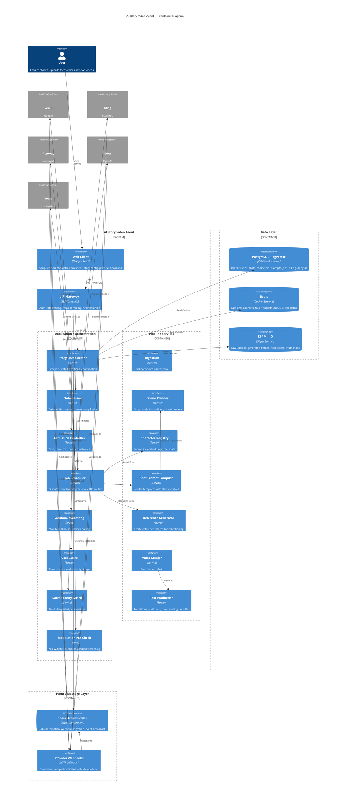
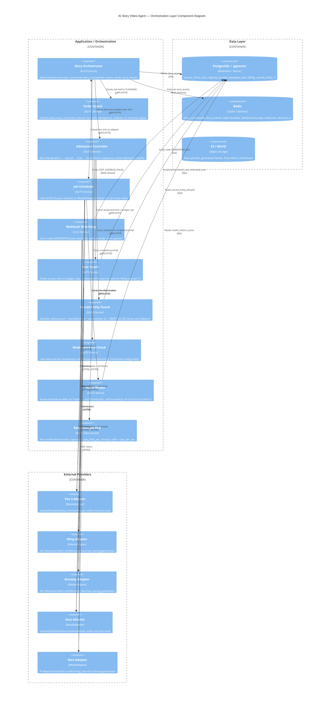

# AI Story Video Agent — Architecture Spec (v5)

Consolidated from four review rounds (Claude + opencode). v1 established the pipeline shape; v2 closed character continuity, cost guardrails, and failure states; v3 closed concurrency/cost interplay, webhook reliability, and retry classification; v4 closes user-driven face-lock continuity (a real uploaded photo, not a generated likeness, must persist across every shot) and adds a non-negotiable Sacred Personality Restriction that hard-blocks any depiction — face, body, or generic silhouette implying identity — of Prophet Muhammad (PBUH), his companions (Sahabah), his family (Ahl al-Bayt), or other sacred/prohibited-imagery personalities, at every stage of the pipeline.

> **v5 changelog:** Specifies per-adapter face-lock image conditioning (verify-only vs. reference-conditioned models); resolves the moderation/sacred ordering contradiction (Moderation → Sacred → Cost → Rate limit); adds enrollment rate limiting, prompt-variable injection sanitization, real OpenAPI examples, and a sacred-guard false-positive runbook; makes the post-generation visual audit mandatory for the sacred class; reframes the false-negative target as "zero on the maintained adversarial suite plus mandatory human review"; and fixes stray text corruption.

## Executive Summary
This specification defines the AI Story Video Agent, a platform that transforms text, audio, or mixed media scripts into professional-quality videos using state-of-the-art generative video models. The system is designed around a modular pipeline: ingestion, scene planning per shot, model‑agnostic shot generation with adapters for Veo 3, Kling, Runway, Sora, and Wan (local), and finally merging, post‑production, and delivery. Core differentiators include a **User Face‑Lock Reference** that guarantees a user‑uploaded face appears unchanged throughout the video, and a **Sacred Personality Restriction** that absolutely blocks any depiction of Prophet Muhammad (PBUH), his companions, family, or other designated sacred figures via a denylist enforced at character creation, registry write, and pre‑dispatch moderation.

Non‑functional requirements are addressed through a **Concurrency & Cost Admission** controller that enforces per‑story slots (derived from subscription tier), per‑model rate limits, and a committed‑spend cost guard to prevent budget overruns. Reliability is achieved via a webhook/poll watchdog with idempotency, and extensibility via an **IModelAdapter** plugin layer and an **AUTO Router** that selects models based on realism, cost, and estimated start time. The architecture is split into client (Next.js/React), API gateway, application/orchestration layer, data layer (PostgreSQL with pgvector, Redis, S3/MinIO), and event/message layer.

**This platform operates as an AI Video Production Specialist: a digital full-time-equivalent role that plans, generates, and delivers video content end-to-end while escalating ambiguous or policy-flagged cases to human review.**

Delivery is organized into a **Phased Implementation Roadmap** (Section 14) that delivers testable increments every 2–6 weeks, beginning with foundations and ingestion and ending with hardening, observability, and game‑day readiness. Each phase includes explicit success criteria so stakeholders can validate progress early and often. Complementary recommendations (Section 13) cover testing, performance benchmarks, security hardening, error‑handling policies, and DevOps practices to ensure the system is production‑ready, maintainable, and scalable.

---

## Digital FTE Role

**Role name:** AI Video Production Specialist

**Function:** Owns the end-to-end video production workflow — script intake, shot planning, model/vendor selection, continuity and compliance enforcement, cost tracking, and delivery.

**Escalation model:** Routes ambiguous cases (face-lock mismatch, sacred-entity edge cases, cost overruns) to human review rather than deciding unilaterally. The platform enforces guardrails and surfaces decisions with context; final disposition on flagged cases always requires human acknowledgment.

---

## Table of Contents
- [Digital FTE Role](#digital-fte-role)
1. [High-Level Architecture](#1-high-level-architecture)
2. [Model Picker](#2-model-picker)
3. [Story State Machine](#3-story-state-machine)
4. [Concurrency & Cost Admission](#4-concurrency--cost-admission)
5. [Failure Handling](#5-failure-handling)
6. [Webhook / Poll Reliability](#6-webhook--poll-reliability)
7. [Character Continuity](#7-character-continuity)
8. [User Face‑Lock Reference](#8-user-face-lock-reference)
9. [Sacred Personality Restriction](#9-sacred-personality-restriction)
10. [Data Model](#10-data-model)
    10.2. [API Contract Examples](#102-api-contract-examples)
11. [AUTO Router Formula](#11-auto-router-formula)
12. [Gap Closure Table](#12-gap-closure-table)
13. [Recommendations for Implementation & Operations](#13-recommendations-for-implementation--operations)
14. [Phased Implementation Roadmap](#14-phased-implementation-roadmap)
    14.1. [Resourcing & Effort Estimates](#141-resourcing--effort-estimates)

---

## 1. High-Level Architecture
The system consists of five horizontal layers:

1. **Client Layer** – Next.js/React web application providing user interface for script upload, character/face upload, story configuration, preview, and download.
2. **API Gateway** – REST/GraphQL entry point handling authentication, rate limiting, request routing, and API versioning.
3. **Application / Orchestration Layer** – Core services:
   - **Story Orchestrator** – manages story lifecycle, state transitions, and coordinates subprocesses.
   - **Order Guard** – enforces subscription‑based quotas and concurrency limits.
   - **Admission Controller** – evaluates cost, resources, and policy constraints before job admission.
   - **Job Scheduler** – dispatches shot‑generation jobs to appropriate model adapters based on AUTO router scores.
   - **Webhook Watchdog** – monitors asynchronous model callbacks, triggers fallback polling if webhooks are delayed.
   - **Cost Guard** – tracks committed spend vs. budget caps per story.
   - **Sacred Entity Guard** – blocks any request involving denylisted personalities.
   - **Moderation Pre‑Check** – screens prompts for NSFW, hate speech, harassment, etc., before sacred‑entity check.
4. **Pipeline Services** – per‑shot processing stages:
   - **Ingestion** – validates and stores user media (images, audio, video).
   - **Scene Planner** – breaks script into shots, determines visual continuity requirements.
   - **Moderation** (pre‑check) – see above.
   - **Character Registry** – stores face/voice embeddings and metadata per character.
   - **Shot Prompt Compiler** – renders prompt templates with shot‑specific variables.
   - **Reference Generator** – creates reference images (if needed) for pose/appearance guidance.
   - **Shot Prompt Compiler (final)** – final prompt sent to video model.
   - **Video Merger** – concatenates generated shots into a cohesive video.
   - **Post‑Production** – adds transitions, audio mixing, color grading, subtitles.
5. **Data Layer**:
   - **PostgreSQL** (with pgvector) – stores relational data (users, stories, shots, characters, prompts, jobs, billing, denylist, prompt templates).
   - **Redis** – caches, rate‑limit counters, model‑specific token buckets, pub/sub for job status.
   - **S3 / MinIO** – object storage for raw uploads, generated frames, final videos, thumbnails.
6. **Event / Message Layer**:
   - **Redis Streams / SQS** – asynchronous job coordination, webhook ingestion, event broadcasting.
   - **Webhooks** – model providers POST generation completion/status; system validates idempotency and timestamps.

Communication flows: Client → API Gateway → Orchestration Services → Pipeline Services → Data/Event Layers → Model Adapters → (via Webhook/Poll) back to Orchestration → Post‑Production → Delivery.

### Diagram (C4‑style Container View)
```
+------------------+      +-------------------+      +---------------------+
|   Client (Web)   |<---->|   API Gateway     |<---->| Auth / Rate Limit   |
+------------------+      +-------------------+      +---------------------+
                                   |
                                   v
                        +----------------------------+
                        | Application / Orchestration|
                        |  (Orchestrator, Order Guard,|
                        |   Admission, Scheduler,    |
                        |   Watchdog, Cost Guard,    |
                        |   Sacred Guard, Moderation)|
                        +----------------------------+
                                   |
                 +-----------------+-----------------+
                 |                                 |
          +-------------------+           +-------------------+
          |   Data Layer      |           | Event / Message   |
          | (PG, Redis, S3)   |           | Layer (Redis/SQS) |
          +-------------------+           +-------------------+
                 |                                 |
          +-------------------+           +-------------------+
          | Pipeline Services |           | Model Adapters    |
          | (Ingest, Plan,    |           | (Veo3, Kling,     |
          |  CharReg, Prompt, |           |  Runway, Sora,    |
          |  RefGen, Merge,   |           |  Wan, AUTO router)|
          |  Post‑Prod)       |           +-------------------+
          +-------------------+
```

### Mermaid C4 Container Diagram (for stakeholder sign-off)


### Mermaid C4 Component Diagram — Orchestration Layer (L2 Detail)


### Mermaid Sequence Diagram — Per-Shot Pipeline (Fixed Order: Moderation → Sacred → Cost → Rate Limit)
```mermaid
sequenceDiagram
    autonumber
    participant Client
    participant API_GW as API Gateway
    participant Ingest as Ingestion
    participant Planner as Scene Planner
    participant PromptRaw as Prompt Compiler (raw)
    participant Sanitize as Sanitize Vars (allowlist [a-zA-Z0-9_.]{1,32})
    participant PromptFinal as Compile Prompt (final)
    participant Moderation as Moderation Pre-Check
    participant Sacred as Sacred Entity Guard
    participant Cost as Cost Guard
    participant RateLimit as Rate Limit (Token Bucket)
    participant Router as AUTO Router
    participant Adapter as IModelAdapter.submitShot
    participant Webhook as Webhook / Poll Watchdog
    participant FaceVerify as Face Verify (ArcFace cosine)
    participant SacredAudit as Sacred Visual Audit (mandatory)
    participant Merger as Video Merger

    Client->>API_GW: POST /stories (script, face, voice)
    API_GW->>Ingest: Validate + store uploads (S3 presigned PUT 5m)
    Ingest->>Planner: Script + media refs
    Planner->>PromptRaw: Shot plan + templates
    PromptRaw->>Sanitize: Raw prompt + user vars
    Sanitize->>PromptFinal: Compiled prompt (HTML-escaped)
    PromptFinal->>Moderation: Scan for NSFW/hate/violence
    alt Moderation FAIL
        Moderation-->>Client: FLAGGED content_policy
    else Moderation PASS
        PromptFinal->>Sacred: Scan denylist (exact + fuzzy + SBERT ≥0.78)
        alt Sacred FAIL
            Sacred-->>Client: FLAGGED sacred_entity (no model call)
        else Sacred PASS
            PromptFinal->>Cost: Projected total ≤ budget_cap?
            alt Cost FAIL
                Cost-->>Client: COST_OVERRUN_PAUSE
            else Cost PASS
                PromptFinal->>RateLimit: Token available for model?
                alt RateLimit FAIL
                    RateLimit-->>Client: QUEUED (wait for token)
                else RateLimit PASS
                    PromptFinal->>Router: Rank feasible models
                    Router->>Adapter: submitShot(compiled_prompt, params)
                    Adapter-->>Webhook: async job_id
                    Webhook->>FaceVerify: Extract frame → ArcFace cosine vs ref
                    alt FaceVerify FAIL
                        FaceVerify-->>Client: FLAGGED face_lock → REVIEW
                    else FaceVerify PASS
                        Webhook->>SacredAudit: Image classifier (silhouette/body implied identity)
                        alt SacredAudit FAIL
                            SacredAudit-->>Client: FLAGGED sacred_entity → human review
                        else SacredAudit PASS
                            Webhook->>Merger: Concat shots → final MP4
                            Merger-->>Client: READY_FOR_REVIEW
```

---

---

## 2. Model Picker
The system supports multiple video generation models via an **IModelAdapter** interface. Each adapter implements:
- `initialize(config)`
- `submitShot(prompt, params) → jobId`
- `pollStatus(jobId) → status`
- `retrieveResult(jobId) → videoArtifacts`
- `estimateCost(prompt, params) → costUSD`
- `estimateLatency(params) → estimatedSeconds`

### Supported Models (v4)
| Model   | Provider | Modality | Typical Latency (s/shot) | Cost (USD/s of video) | Face‑Lock Conditioning | Notes |
|---------|----------|----------|--------------------------|-----------------------|------------------------|-------|
| Veo 3   | Google   | T2V      | 8‑12                     | 0.10                                | Verify‑only (no native ID conditioning) | High realism, good lip‑sync |
| Kling   | Kuaishou | T2V/I2V  | 6‑10                     | 0.07                                | I2V reference frame | Strong motion coherence |
| Runway  | RunwayML | T2V/I2V  | 5‑9                      | 0.09                                | I2V reference frame | Good stylization controls |
| Sora    | OpenAI   | T2V      | 10‑15                    | 0.12                                | Verify‑only (no native ID conditioning) | State‑of‑the‑art coherence |
| Wan     | Local    | T2V/I2V  | 4‑8 (GPU dependent)     | 0.04 (amortized)                    | IP‑Adapter / InstantID (image embedding) | Fully private, lower cost, controllable |

The **AUTO Router** (see §11) selects the optimal model per shot based on realism, cost, and expected start time.

---

## 3. Story State Machine
Each story progresses through a well‑defined state machine. States are persisted in the `stories` table (`status` column). Transitions are triggered by the Orchestrator based on job outcomes, user actions, or system events.

```
[START] --> (script received) --> [QUEUED]
[QUEUED] --> (admission passes) --> [PLANNING]
[PLANNING] --> (scene plan ready) --> [SHOT_GEN_QUEUE]
[SHOT_GEN_QUEUE] --> (model assigned) --> [GENERATING]
[GENERATING] --> (shot completed) --> [SHOT_COMPLETE] (loop per shot)
[SHOT_COMPLETE] --> (all shots done) --> [MERGING]
[MERGING] --> (video assembled) --> [POST_PRODUCTION]
[POST_PRODUCTION] --> (final video ready) --> [READY_FOR_REVIEW]
[READY_FOR_REVIEW] --> (user reviews) --> [APPROVED]  (if accepted)
                                          --> [NEEDS_EDIT] (if edits requested)
                                          --> [FLAGGED]  (if policy/sacred/face‑lock/voice‑drift issue)
[APPROVED] --> (export/deliver) --> [DONE]
[NEEDS_EDIT] --> (user edits) --> [PLANNING] (cycle repeats)
[FLAGGED] --> (admin review) --> [REVIEWED] --> [APPROVED] or [REJECTED]
[ANY_STATE] --> (fatal error) --> [FAILED]
[ANY_STATE] --> (cost overrun) --> [COST_OVERRUN_PAUSE] --> (adminresolve) --> [QUEUED]
```

**Key Flags**
- `requires_visual_continuity` (boolean): if true, the system enforces face‑lock and pose consistency across shots.
- `cost_estimate_usd` (decimal): cumulative estimate of all shots in QUEUED+GENERATING states.
- `actual_cost_usd` (decimal): sum of completed shot costs.
- `flag_reason` (enum): `none`, `content_policy`, `sacred_entity`, `face_lock`, `voice_drift`, `cost_overrun`, `other`.

All state transitions are immutable; a new record is appended to the `story_events` table for audit.

---

## 4. Concurrency & Cost Admission
### 4.1 Per‑Story Concurrency Slots
- Derived from the user's subscription tier (stored in `plans.max_concurrent_stories`).
- The **Order Guard** checks `active_stories_count < max_concurrent_stories` before moving a story from QUEUED to PLANNING.

### 4.2 Per‑Model Rate Limiting
- Each model adapter exposes a `rate_limit_per_minute`.
- Redis token bucket tracks available tokens per model; the **Admission Controller** consumes a token when assigning a shot to a model.
- Tokens refill at a fixed rate; burst size equals the per‑minute limit.

### 4.2.1 Biometric Enrollment Throttle
- Face/voice enrollment endpoints (§7.2) are separately rate‑limited **per user** (default **5 enrollments/hour, 20/day**, configurable) to mitigate biometric‑abuse and liveness‑probing vectors (e.g., brute‑forcing the anti‑spoofing model or mass‑enrolling scraped faces).
- Exceeding the limit returns `429 ENROLLMENT_RATE_LIMIT`; repeated violations raise a security alert (§13.3).

### 4.3 Committed‑Spend Cost Guard
- Before admitting a shot, the system computes:
  ```
  projected_total = current_actual_cost + sum(cost_estimate of QUEUED shots) + cost_estimate_of_new_shot
  ```
- If `projected_total > story.budget_cap_usd`, the shot is rejected and the story transitions to `COST_OVERRUN_PAUSE`.
- **Cost Drift Hard Pause** (see Recommendation #7): after each job completion, compute `overrun_ratio = (actual_cost_usd - cost_estimate) / cost_estimate` for the story.
  - If `overrun_ratio > 0.5` **OR** the average overrun over the last 10 shots > 0.2, set a temporary admission block (`status = COST_OVERRUN_PAUSE`) and alert admins.
  - Admission Controller checks this block before evaluating slots and rate limits.

### 4.4 Admission Decision Flow
Checks run in a fixed, canonical order — cheapest and most legally/ethically critical rejections first: **Moderation → Sacred → Cost → Rate limit**. (This resolves the earlier ordering ambiguity; §6.3 and §9.2 follow the same sequence.)
1. Order Guard: concurrency slot available?
2. Admission Controller (evaluated in order):
   - Moderation Pre‑Check passes? (see §6.1)
   - Sacred Entity Guard passes? (see §9)
   - Cost Guard passes? (projected total ≤ budget cap)
   - Cost Drift Pause not active?
   - Model token available? (rate limit)
3. If all pass, assign model via AUTO Router, decrement token, increment QUEUED shot count, advance state.

---

## 5. Failure Handling
Errors are classified as **transient** (retryable) or **permanent** (terminal). Classification is based on error codes/exceptions from model adapters, infrastructure, or validation.

### 5.1 Transient Errors
- Network timeouts, HTTP 5xx, temporary throttling, temporary storage unavailable.
- Retry policy: exponential backoff (base 1s, factor 2, max 10s) with jitter, max 3 attempts.
- After exhausting retries, escalate to permanent.

### 5.2 Permanent Errors
- Invalid input (malformed prompt, unsupported parameters).
- Model‑specific permanent failures (e.g., content filter block, model internal error).
- Validation failures (face‑lock mismatch, sacred‑entity hit, policy violation).
- Cost overrun (handled by Admission Controller).
- Permanent errors transition the shot to `FAILED` (or appropriate flagged state) and emit an alert.

### 5.3 State Surfacing to UI
- Each shot exposes `status` and optional `flag_reason`.
- Story aggregates the worst‑case status among its shots.
- UI shows:
  - `QUEUED` / `GENERATING` with progress bar.
  - `READY_FOR_REVIEW` when all shots are `ACCEPTED`.
  - `NEEDS_EDIT` if user requests changes.
  - `FLAGGED` with reason tooltip (content_policy, sacred_entity, face_lock, voice_drift, cost_overrun).
  - `FAILED` with retry button (if transient) or error details.

### 5.4 Logging & Metrics
- Every job attempt logs: `job_id`, `model`, `attempt_number`, `error_code`, `error_message`, `latency_ms`, `cost_usd`.
- Metrics exported to Prometheus: `job_attempts_total`, `job_failures_total`, `retry_attempts_total`, `cost_overrun_events_total`.

---

## 6. Webhook / Poll Reliability
### 6.1 Callback Mode (Preferred)
- Model providers POST a signed webhook to `/webhooks/{provider}` with `job_id`, `status`, `result_url` (if completed), `cost_usd`.
- **Contract guarantees**:
  - `X-Signature` = HMAC-SHA256(`shared_secret`, body). Reject if invalid.
  - `X-Timestamp` = Unix epoch seconds. Reject if `abs(now - ts) > 300s` (5-min skew).
  - `X-Idempotency-Key` = `{job_id}:{provider}`. Stored in Redis via `SET key value NX EX 300` (5-min TTL). Duplicate within 5 min returns `200 OK { "received": true, "duplicate": true }` without reprocessing.
  - **Secret Rotation**: Two active HMAC secrets supported. Provider includes `kid` (key ID) header; system verifies against matching secret.
- Endpoint validates signature, checks `job_id` exists, ensures timestamp within skew, checks idempotency, updates job record, notifies Orchestration via Redis Stream.

### 6.2 Fallback Polling (Watchdog)
- The **Webhook Watchdog** runs every 30 seconds, scanning jobs where:
  - `status = GENERATING` AND
  - `updated_at < now() - (expected_duration × 1.5)`.
- For each stale job, the Watchdog issues a poll request to the model's status endpoint (if supported) or marks the job as `SUSPECTED_TIMEOUT` and triggers retry logic per §5.
- **Poll Fallback Metric**: `poll_fallback_total` counter incremented per poll.

### 6.3 Moderation Pre‑Check (Recommendation #8)
- Inserted **after** Shot Prompt Compiler but **before** Sacred Entity Guard.
- Calls an external text‑moderation API (e.g., AWS Comprehend, Azure Content Moderator, or open‑source detoxify model) to detect:
  - NSFW / sexual content
  - Hate speech
  - Harassment / bullying
  - Violence
  - Illegal activities
- If any category exceeds threshold (configurable, e.g., confidence > 0.8), the shot is routed to `FLAGGED` with `flag_reason = content_policy`.
- Allows model swap/retry as usual (different model may produce compliant output).

---

## 7. Character Continuity
Ensures consistent appearance (face, voice, attire) of user‑defined characters across shots.

### 7.1 Data Model (see §10)
- `char_registry` table stores per‑character:
  - `face_embedding_vector` (512‑dim ArcFace, AES‑256 encrypted at rest)
  - `voice_embedding_vector` (256‑dim ECAPA‑TDNN or X‑vector, encrypted)
  - `face_match_threshold` (float, default 0.45, configurable per character)
  - `voice_match_threshold` (float, default 0.60)
  - `requires_visual_continuity` (boolean)
  - `requires_audio_continuity` (boolean)
  - `created_by`, `updated_at`, `version`

### 7.2 Enrollment (Upload)
1. User uploads a clear frontal face image (JPEG/PNG, ≤5 MB).
2. System runs:
   - **Liveness detection** (Recommendation #2) – e.g., anti‑spoofing model; if score < 0.8, reject and prompt for genuine photo.
   - **Face embedding extraction** (ArcFace) → `face_embedding_vector`.
   - **Optional voice sample** (if user provides audio) → ECAPA‑TDNN embedding → `voice_embedding_vector`.
3. Embeddings are encrypted with a per‑user envelope key (AES‑256‑GCM) before storage.
4. Record inserted into `char_registry` with `active_flag = true`.

### 7.3 Shot Generation Checks
- **Face‑Lock**: After shot generation, extract face embedding from the generated frame(s) (using same ArcFace model). Compute cosine similarity with stored reference.
  - If similarity < `face_match_threshold` → flag as `FACE_LOSS` → route to `REVIEW` with warning.
  - If `requires_visual_continuity` is false, skip check.
- **Voice‑Lock** (Recommendation #9): If character has voice clip and `requires_audio_continuity` true:
  - Extract speech segments from generated audio, compute speaker embedding, compare to stored voice embedding.
  - If similarity < `voice_match_threshold` → flag as `VOICE_DRIFT` → route to `REVIEW` with warning.
- Checks are performed asynchronously; failures do not halt generation but post‑process routing.

### 7.4 Privacy / GDPR (Face & Voice)
- Biometric data stored encrypted at rest; keys managed via **HashiCorp Vault Transit** (KEK) with auto-rotation every 90 days; per-user DEK encrypted as `dek_encrypted` in `char_registry` (§10.3).
- Access logs immutable (write‑once storage) recording who accessed which embedding and when.
- Right‑to‑be‑forgotten: deletion request triggers crypto‑shredding of the envelope key and removal of all rows referencing the character ID; associated media in S3 is deleted per lifecycle (see §10.5).
- Retention: raw uploads retained 30 days in standard storage, then Glacier Deep Archive for 335 days, then deleted unless user requests earlier deletion.

---

## 8. User Face‑Lock Reference
### 8.1 Purpose
Guarantees that a user‑provided portrait appears unchanged (within similarity threshold) in every shot where the character appears, preventing drift or substitution by the model.

### 8.2 Workflow
1. **Upload & Liveness** (§7.2).
2. **Storage** of encrypted face embedding.
3. **Prompt Compilation**: The Shot Prompt Compiler injects a descriptor like `"{character_name}`'s face, consistent with reference ID X"` into the prompt template.
4. **Generation**: Face‑lock behavior is **adapter‑dependent** (see the §2 model table):
   - **Reference‑conditioned adapters** (Wan via IP‑Adapter/InstantID; Kling/Runway via I2V reference frame): the Reference Generator produces a canonical reference image from the enrolled embedding, and the adapter receives that image (or its ArcFace/IP embedding) as a conditioning input alongside the text prompt. Identity is *steered during generation*, not merely checked afterward — this materially lowers the post‑check rejection rate.
   - **Verify‑only adapters** (Veo 3, Sora — no native identity conditioning): the prompt carries the text descriptor only, and identity is enforced purely by post‑generation verification (step 5). These adapters have a structurally higher regeneration rate.
   - **Router policy**: when a character has `requires_visual_continuity = true`, the AUTO Router **down‑ranks verify‑only adapters** and prefers a conditioning‑capable model, unless the user explicitly pins a verify‑only model (in which case the higher expected regeneration cost is surfaced in the estimate).
5. **Post‑Generation Verification**: As described in §7.3 — applied to **all** adapters regardless of conditioning support.
6. **Feedback Loop**: If face‑lock fails, the shot is sent to `REVIEW`. The user can:
   - Accept the slight deviation (if within tolerance) → manually override threshold for that shot.
   - Request regeneration with adjusted prompt or different model.
   - Upload a new reference image (updates `face_embedding_vector` and increments `version`).

### 8.3 Configuration (Recommendation #1)
- Default `face_match_threshold` = **0.45** (ArcFace cosine similarity).
- Stored per‑character in `char_registry.face_match_threshold`; editable by user (range 0.30–0.70).
- System logs distribution of similarity scores per shot to a metrics store (e.g., Prometheus histogram) weekly for threshold tuning.

### 8.4 Face‑Lock Conditioning & Data Flow
Face‑lock is a **conditioning + verification** system, not prompt‑text alone. How identity reaches the model depends on the adapter's capabilities (see the §2 model table):

```
                                          ┌─ reference-conditioned adapter ─┐
 Enrolled face image                      │  (Wan: IP-Adapter/InstantID,    │
        │                                 │   Kling/Runway: I2V ref frame)  │
        ▼                                 │                                 │
   ArcFace embed ──► char_registry ──► Reference Generator ──► image + embed│──► steered generation
   (512-d, encrypted)                     │                                 │        │
        │                                 └─────────────────────────────────┘        │
        │                                 ┌─ verify-only adapter ───────────┐        │
        │                                 │  (Veo 3, Sora: text descriptor  │        │
        └────────────────────────────────┤   only, no ID conditioning)     │──► unsteered generation
                                          └─────────────────────────────────┘        │
                                                                                      ▼
                                          generated frame ──► ArcFace embed ──► cosine sim vs. reference
                                                                                      │
                                                        sim ≥ threshold ──► COMPLETED │ sim < threshold ──► FLAGGED(face_lock) ──► REVIEW
```

- **Reference-conditioned path**: identity is injected during generation, so the post-check is a guardrail rather than the primary control — regeneration rates stay low.
- **Verify-only path**: identity is not steerable, so post-check rejections (and regenerations) are structurally higher; the AUTO Router down-ranks these for continuity-sensitive characters and surfaces the higher expected cost when a user pins them (§8.2 step 4).

### 8.5 Threshold Tuning Plan (Recommendation)
- Similarity scores per shot are logged to a Prometheus histogram, bucketed by model, genre, and (coarse) demographic slice to detect fairness skew.
- A weekly batch job computes the false-positive rate (accepted-by-user shots that fell below threshold) and false-negative rate (rejected-by-user shots that passed), then **auto-suggests** a per-model threshold adjustment to keep FPR ≤ 2 % (§13.2). Suggestions are surfaced to an operator for approval — thresholds are not auto-applied.
- **Fairness delta alert**: if any demographic slice's FPR exceeds the global FPR by > 1.5×, fire `face_lock_fairness_delta` alert (PagerDuty/Slack) and block auto-suggestions until operator review.
- Per-character user overrides (range 0.30–0.70) always take precedence over the model default.

---

## 9. Sacred Personality Restriction
### 9.1 Purpose
Absolutely prohibit any depiction — visual, auditory, or implied — of Prophet Muhammad (PBUH), his companions (Sahabah), his family (Ahl al‑Bayt), or other personalities designated by the Trust & Safety team.

### 9.2 Enforcement Points
1. **Character Creation** – if the provided name matches a denylisted entry (see §9.3), creation is rejected with error `SACRED_ENTITY`.
2. **Registry Write** – any attempt to associate a denylisted name with a character is blocked.
3. **Moderation Pre‑Check** (§6.1) – scans the compiled prompt for denylisted terms; if found, flags as `content_policy` (treated same as other policy violations) *or* directly as `sacred_entity` depending on configuration.
4. **Pre‑Dispatch Guard** – right before submitting a shot to a model adapter, the **Sacred Entity Guard** re‑checks:
   - Character name against denylist.
   - Prompt text for any denylisted phrasing.
   - If any match, the shot is sent to `FLAGGED` with `flag_reason = sacred_entity`; no model call is made.
5. **Post‑Generation Visual Audit** (**mandatory for the sacred class**) – generated frames are run through an image‑classifier trained to detect disallowed depictions, **including generic silhouettes or body forms that imply a prohibited identity** (which a name/text‑based denylist cannot catch). Every shot in a sacred‑flagged or continuity‑sensitive story is audited; all other stories are audited on a random sample. Any detection routes the job to `FLAGGED(sacred_entity)` and mandatory human review before release.

> **Prompt‑injection note**: user‑supplied fields interpolated into prompts (e.g., `{character_name}`) are sanitized before compilation (§13.3), and the **compiled** prompt — not just the raw field — is what the Moderation Pre‑Check and Sacred Entity Guard scan. A denylisted term smuggled through a name field is therefore still caught at pre‑dispatch.

### 9.3 Denylist & Fuzzy Matching (Recommendation #3)
- **Exact match**: case‑insensitive, Unicode NFKC normalized.
- **Fuzzy match** (applied after exact): 
  1. Normalize string (NFKC, lower‑case).
  2. Apply transliteration map (e.g., Arabic→Latin, Cyrillic→Latin) to approximate phonetic similarity.
  3. Compute Levenshtein distance ≤ 2 **OR** sentence‑embedding cosine similarity ≥ 0.78 (using multilingual SBERT model `paraphrase-multilingual-mpnet-base-v2`).
- If either condition passes, treat as match.
- The denylist is managed by the Trust & Safety team:
  - Updated monthly based on emerging variants.
  - Quarterly review by senior scholars.
  - All changes logged with approver and reason in an immutable audit table (`sacred_entity_audit`).

### 9.4 Governance & Testing
- **Automated Test Suite** (CI): ≥ 50 adversarial prompts covering:
  - Misspellings (e.g., "Muhammd", "Mohamed").
  - Transliteration variants (e.g., "Mohammed", " Mehmet").
  - Honorary titles (e.g., "The Messenger", "Seal of the Prophets").
  - Paraphrases (e.g., "the final messenger in the cave", "Abu Bakr’s companion").
  - Code‑switching (mix of languages).
- Tests run against the **Sacred Entity Guard** and must pass with **zero false negatives on the maintained adversarial suite**. Because fuzzy/semantic matching cannot guarantee zero false negatives against *arbitrary* open‑world paraphrase, the guard is backed by defense‑in‑depth: multi‑stage enforcement (§9.2), a **mandatory** post‑generation visual audit (§9.2.5) for this class, and **mandatory human review of every `FLAGGED(sacred_entity)` item** before release. False positives are logged and reviewed (runbook in §13.9).
- Documentation of the denylist and its rationale is accessible to internal stakeholders only.

---

## 10. Data Model
### 10.1 Core Tables

#### `plans`
| Column | Type | Description |
|--------|------|-------------|
| id | UUID PK | |
| name | varchar | e.g., "Basic", "Pro", "Enterprise" |
| price_monthly | decimal | |
| max_concurrent_stories | integer | |
| shots_per_month | integer | |
| budget_cap_usd | decimal | per‑story default (overridable per story) |
| features | jsonb | feature flags |

#### `users`
| Column | Type | Description |
|--------|------|-------------|
| id | UUID PK | |
| email | varchar | unique |
| name | varchar | |
| password_hash | varchar | |
| plan_id | FK → plans.id | |
| created_at | timestamptz | |
| updated_at | timestamptz | |

#### `stories`
| Column | Type | Description |
|--------|------|-------------|
| id | UUID PK | |
| user_id | FK → users.id | |
| title | varchar | |
| script_text | text | |
| status | varchar | QUEUED, PLANNING, SHOT_GEN_QUEUE, GENERATING, SHOT_COMPLETE, MERGING, POST_PRODUCTION, READY_FOR_REVIEW, APPROVED, NEEDS_EDIT, FLAGGED, REVIEWED, FAILED, COST_OVERRUN_PAUSE, DONE, REJECTED |
| requires_visual_continuity | boolean | |
| requires_audio_continuity | boolean | |
| budget_cap_usd | decimal | overrides plan default |
| actual_cost_usd | decimal | accumulated |
| estimated_cost_usd | decimal | sum of QUEUED+GENERATING estimates |
| flag_reason | varchar | NULL, content_policy, sacred_entity, face_lock, voice_drift, cost_overrun, other |
| created_at | timestamptz | |
| updated_at | timestamptz | |

#### `shots`
| Column | Type | Description |
|--------|------|-------------|
| id | UUID PK | |
| story_id | FK → stories.id | |
| shot_index | integer | 0‑based |
| prompt_template_id | FK → prompt_template.id | |
| prompt_template_version | integer | |
| prompt_text | text | final compiled prompt |
| model_used | varchar | e.g., "veo3" |
| status | varchar | QUEUED, GENERATING, COMPLETED, FAILED, FLAGGED |
| cost_estimate_usd | decimal | |
| actual_cost_usd | decimal | |
| face_match_score | decimal | NULL if not checked / passed |
| voice_match_score | decimal | NULL if not checked / passed |
| flag_reason | varchar | NULL, content_policy, sacred_entity, face_lock, voice_drift, other |
| created_at | timestamptz | |
| updated_at | timestamptz | |

#### `char_registry`
| Column | Type | Description |
|--------|------|-------------|
| id | UUID PK | |
| story_id | FK → stories.id | |
| name | varchar | character name (user‑defined) |
| face_embedding_vector | vector(512) | encrypted, stores ArcFace embedding |
| face_match_threshold | float | default 0.45, user‑editable |
| voice_embedding_vector | vector(256) | encrypted, ECAPA‑TDNN or X‑vector (nullable) |
| voice_match_threshold | float | default 0.60 |
| requires_visual_continuity | boolean | |
| requires_audio_continuity | boolean | |
| version | integer | increments on re‑upload |
| active_flag | boolean | |
| created_at | timestamptz | |
| updated_at | timestamptz | |

#### `prompt_template`
| Column | Type | Description |
|--------|------|-------------|
| id | UUID PK | |
| version | integer | |
| content_sha256 | char(64) | hash of `content_text` |
| content_text | text | the prompt template with placeholders (e.g., `{character_name}`, `{action}`) |
| active_flag | boolean | only one version per `id` can be active at a time |
| created_at | timestamptz | |

**Prompt Template Versioning & Rollback**: Templates are immutable — new version = new row with incremented `version`. Rollback = set `active_flag=true` on previous version, `false` on current. No data migration needed for rollback.

**Database Migration Strategy**: All migrations use **expand/contract pattern** (Flyway/Liquibase). No destructive DDL (DROP COLUMN, ALTER TYPE) in deploy phase. Backward-compatible first (add column, dual-write), then contract in next release. Zero-downtime guaranteed.

#### `jobs`
| Column | Type | Description |
|--------|------|-------------|
| id | UUID PK | |
| shot_id | FK → shots.id | |
| provider | varchar | e.g., "veo3", "kling" |
| external_job_id | varchar | provider’s identifier |
| status | varchar | QUEUED, GENERATING, COMPLETED, FAILED |
| cost_usd | decimal | actual cost charged by provider |
| started_at | timestamptz | |
| ended_at | timestamptz | |
| result_url | varchar | signed S3 URL to output |
| created_at | timestamptz | |
| updated_at | timestamptz | |

#### `story_events` (audit)
| Column | Type | Description |
|--------|------|-------------|
| id | UUID PK | |
| story_id | FK → stories.id | |
| event_type | varchar | e.g., "status_change", "flag_raise", "cost_update" |
| details | jsonb | context‑specific payload |
| created_at | timestamptz | |

#### `sacred_entity_denylist`
| Column | Type | Description |
|--------|------|-------------|
| id | UUID PK | |
| entity_name | varchar | normalized base name |
| language | varchar | ISO‑639‑3 code (optional) |
| added_at | timestamptz | |
| added_by | UUID FK → admins.id | |
| reason | text | |
| active_flag | boolean | |

#### `sacred_entity_audit` (append‑only)
| Columns same as denylist + `action` (ADD/REMOVE/UPDATE), `performed_by`, `performed_at`.

#### `billing`
| Column | Type | Description |
|--------|------|-------------|
| id | UUID PK | |
| story_id | FK → stories.id | |
| amount_usd | decimal | |
| description | text | |
| invoice_date | date | |
| paid_at | timestamptz | nullable |
| created_at | timestamptz | |

### 10.2 API Contract Examples
Representative request/response pairs for the endpoints devs build against first. Full machine-readable spec lives in `/docs/openapi.yaml`; the excerpts below are the source of truth for shapes and status codes.

#### `POST /stories` — create a story
Request:
```json
{
  "title": "The Lighthouse Keeper",
  "script_text": "A weathered keeper climbs the spiral stair at dawn...",
  "requires_visual_continuity": true,
  "requires_audio_continuity": false,
  "budget_cap_usd": 25.00,
  "character_ids": ["c_9f2a...", "c_1b7c..."]
}
```
Response `201 Created`:
```json
{
  "id": "st_4d8e...",
  "status": "QUEUED",
  "estimated_cost_usd": 0.0,
  "actual_cost_usd": 0.0,
  "flag_reason": null,
  "created_at": "2026-08-03T10:15:00Z"
}
```
Errors: `400 VALIDATION_ERROR` (missing script), `402 BUDGET_BELOW_MINIMUM`, `403 PLAN_CONCURRENCY_EXCEEDED`, `422 SACRED_ENTITY` (title/script matched denylist at creation).

#### `POST /characters/enroll` — enroll a face (and optional voice)
Request: `multipart/form-data`
- `story_id`: `st_4d8e...`
- `name`: `"Keeper"`
- `face_image`: `<binary JPEG/PNG, ≤5 MB>`
- `voice_sample` *(optional)*: `<binary wav/mp3, ≤10 MB>`
- `requires_visual_continuity`: `true`

Response `201 Created`:

Headers:
- `X-RateLimit-Enrollment-Remaining`: integer (remaining enrollments in current hour window)

```json
{
  "id": "c_9f2a...",
  "story_id": "st_4d8e...",
  "name": "Keeper",
  "liveness_score": 0.94,
  "face_embedding_stored": true,
  "voice_embedding_stored": false,
  "face_match_threshold": 0.45,
  "version": 1,
  "active_flag": true
}
```
Errors: `400 LIVENESS_FAILED` (score < 0.8), `413 FILE_TOO_LARGE`, `415 UNSUPPORTED_MEDIA_TYPE`, `422 SACRED_ENTITY` (name matched denylist), `429 ENROLLMENT_RATE_LIMIT` (see §4.2.1). Biometric fields are never returned in plaintext.

#### `POST /shots/{id}/retry` — retry or regenerate a shot
Request:
```json
{
  "reason": "face_lock_failed",
  "model_override": "kling",
  "threshold_override": 0.42,
  "regenerate_prompt": false
}
```
Response `202 Accepted`:
```json
{
  "shot_id": "sh_77c1...",
  "status": "QUEUED",
  "attempt_number": 2,
  "model_used": "kling",
  "cost_estimate_usd": 0.63
}
```
Errors: `404 SHOT_NOT_FOUND`, `409 SHOT_NOT_RETRYABLE` (permanent error or terminal state), `402 COST_OVERRUN_PAUSE` (story admission-blocked; clear pause first), `422 SACRED_ENTITY` / `422 CONTENT_POLICY` (recompiled prompt failed a guard).

#### `POST /webhooks/{provider}` — model provider callback
Request headers:
- `X-Idempotency-Key`: `{job_id}:{provider}` (e.g., `job_abc123:kling`)
- `X-Signature`: HMAC-SHA256 of body with shared secret
- `X-Timestamp`: Unix epoch seconds

Request body:
```json
{
  "job_id": "job_abc123",
  "status": "COMPLETED",
  "result_url": "https://provider-cdn.com/outputs/job_abc123.mp4",
  "cost_usd": 0.57,
  "duration_seconds": 8.3
}
```
Response `200 OK`:
```json
{ "received": true, "job_id": "job_abc123" }
```
Errors: `400 INVALID_SIGNATURE`, `400 STALE_TIMESTAMP` (>5 min / 300s skew), `409 DUPLICATE` (idempotency key seen <5 min ago) — returns `200 OK { "received": true, "duplicate": true }`, `404 JOB_NOT_FOUND`.

**Idempotency Guarantee**: `X-Idempotency-Key` stored in Redis via `SET key value NX EX 300` (5-min TTL). Duplicate webhooks within 5 min return `200 OK { "duplicate": true }` without reprocessing.

**Secret Rotation**: Two active HMAC secrets supported simultaneously. Providers include `kid` (key ID) header; system verifies against matching secret.

#### `GET /stories/{id}` — get story with shots
Response `200 OK`:
```json
{
  "id": "st_4d8e...",
  "title": "The Lighthouse Keeper",
  "status": "GENERATING",
  "budget_cap_usd": 25.00,
  "actual_cost_usd": 12.34,
  "estimated_cost_usd": 3.21,
  "flag_reason": null,
  "shots": [
    { "id": "sh_77c1...", "shot_index": 0, "status": "COMPLETED", "model_used": "kling", "cost_usd": 0.57, "face_match_score": 0.52 },
    { "id": "sh_88d2...", "shot_index": 1, "status": "GENERATING", "model_used": "wan", "cost_estimate_usd": 0.48 }
  ],
  "created_at": "2026-08-03T10:15:00Z",
  "updated_at": "2026-08-03T10:18:22Z"
}
```

#### `DELETE /characters/{id}` — delete character (immediate crypto-shred)
Response `204 No Content`:
- Deletes `char_registry` row immediately.
- Crypto-shreds DEK (Vault Transit `destroy`).
- Removes associated S3 objects (face/voice uploads).
- Emits tombstone event to `story_events` and downstream analytics.
- **No soft delete** — irreversible.

Errors: `404 CHARACTER_NOT_FOUND`, `403 FORBIDDEN` (not owner / not admin).

#### `GET /audit/sacred` — retrieve sacred entity audit log
Query params: `entity_id` (optional), `from`, `to`, `limit` (default 100, max 1000).
Response `200 OK`:
```json
{
  "entries": [
    { "entity_id": "se_1a2b...", "entity_name": "Muhammad", "action": "ADD", "performed_by": "admin_3c4d...", "performed_at": "2026-07-15T10:00:00Z", "reason": "Denylist update" }
  ],
  "next_cursor": "abc123"
}
```
RBAC: requires `admin:trust_safety` role.

#### `POST /admin/sacred_denylist` — add/update denylist entry
Request:
```json
{
  "entity_name": "Mohammed",
  "language": "ara",
  "reason": "Transliteration variant",
  "active_flag": true
}
```
Response `201 Created`: `{ "id": "se_5e6f...", "entity_name": "Mohammed", ... }`
RBAC: requires `admin:trust_safety` role. Audit logged to `sacred_entity_audit`.

### 10.3 Data Retention & Privacy
- **Raw uploads** (images, audio, video): 30 days in hot storage (S3 Standard), then transition to Glacier Deep Archive for 335 days, finally deleted unless user requests earlier deletion.
- **Generated frames / intermediate assets**: retained 7 days, then deleted.
- **Final video**: stored until user deletes account or invokes “right to be forgotten”; then crypto‑shredded (delete encryption key) and object removed.
- **Face Embedding Encryption (KMS Hierarchy)**:
  - **DEK per user** (AES-256-GCM) generated on first face enrollment. Stored only as `dek_encrypted` = `VaultTransit_Encrypt(KEK, DEK)` in `char_registry.dek_encrypted`.
  - **KEK** lives in Vault Transit, auto-rotated 90d, never leaves Vault.
  - **DEK decrypted in memory for <100ms per verification**, zeroed after use; never logged.
  - **Raw face_image deleted immediately after embedding + liveness pass** (score ≥ 0.8). Do NOT keep original.
  - **S3 uploads**: presigned PUT TTL 5m, GET TTL 15m, bucket policy denies non-presigned requests.
  - **Biometric deletion** = crypto-shred DEK + delete `char_registry` row + emit tombstone event.
- **Audit logs**: immutable (Write‑Once‑Read‑Many) retention 7 years for compliance.
- **GDPR Right‑to‑Be‑Forgotten**: DELETE request cascades to:
  - Anonymize personal data in `users`, `stories`, `shots`.
  - Delete associated rows in `char_registry`, `prompt_template` (if user‑owned), `jobs`, `billing`.
  - Destroy encryption keys for biometric data.
  - Emit tombstone events to downstream analytics (if any).

### 10.4 Indexing & Performance
- Primary keys as UUIDs; indexes on foreign keys.
- `CREATE INDEX CONCURRENTLY stories_status_updated ON stories(status, updated_at);` — queue workers.
- `CREATE INDEX CONCURRENTLY stories_user_status ON stories(user_id, status, created_at DESC);` — user-scoped story listing with pagination.
- `CREATE INDEX CONCURRENTLY shots_story_status ON shots(story_id, status);` — shot progress queries.
- `CREATE INDEX CONCURRENTLY char_registry_story_name ON char_registry(story_id, name);` — character lookup by story.
- `CREATE INDEX CONCURRENTLY prompt_template_lookup ON prompt_template(id, version, active_flag);` — fast prompt retrieval.
- `CREATE INDEX CONCURRENTLY jobs_shot_provider ON jobs(shot_id, provider);` — cost attribution joins.
- `CREATE INDEX CONCURRENTLY jobs_provider_status ON jobs(provider, status) WHERE status IN ('QUEUED','GENERATING');` — token bucket workers.
- `CREATE INDEX CONCURRENTLY enrollment_user_hour ON user_enrollment_log(user_id, hour_bucket);` — enrollment rate-limit counter scans (hour_bucket = date_trunc('hour', created_at)).
- `CREATE INDEX CONCURRENTLY sacred_audit_entity_time ON sacred_entity_audit(entity_id, performed_at DESC);` — audit lookups by entity.
- Partitions on `stories.created_at` monthly for large‑scale analytics.

### 10.5 Backup & DR
- **PostgreSQL**: physical streaming replication + nightly logical dump (pg_dump) to off‑site bucket.
- **Redis**: AOF snapshotting every hour; RDB snapshot every 6 h.
- **S3**: Cross‑Region Replication (CRR) to a backup bucket with versioning enabled.
- **Encryption**: SSE‑S3 + optional client‑side envelope key for biometrics.
- **RTO**: < 30 min; **RPO**: < 15 min.

---

## 11. AUTO Router Formula
The **AUTO Router** selects the model expected to give the best trade‑off of realism, cost, and start time for each shot.

### 11.1 Core Formula
```
feasible = token_available AND cost_pass AND NOT drift_paused
if requires_visual_continuity:
    downrank verify-only adapters by 0.5
score = 0.5 * realism_score(genre) - 0.3 * norm(cost_usd) - 0.2 * norm(eta_seconds)
norm(x) = (x - min) / (max - min) across feasible set
realism_score from model_realism_cache updated nightly from watch-time / ratings
fallback: iterate ranked feasible models in order; first to pass admission -> assign
if none feasible: shot stays QUEUED, metric no_viable_model++
```
- Weights `w1=0.5`, `w2=0.3`, `w3=0.2` configurable via feature flag.
- `realism_score(genre)` sourced from `model_realism_cache` (nightly batch from watch-time/ratings).
- `norm(x)` = min-max normalization across **feasible** models only.
- **Feasibility filter**: model must have `token_available` (rate limit), `cost_pass` (projected ≤ budget), `NOT drift_paused` (cost drift block). If `requires_visual_continuity=true`, verify-only adapters downranked by 0.5 multiplier.

The model with the highest `score` is selected, provided it passes admission checks.

### 11.2 Dynamic Realism Score (Recommendation #6)
- `model_realism` is **not** static; it is a rolling acceptance rate:
  ```
  model_realism(model, genre) = 
      (shots_rated_≥4_by_users_in_last_30d) /
      (total_shots_for_model_in_last_30d)
```
  clamped to the range `[0.0, 1.0]`.
- Updated nightly via a batch job that:
  1. Aggregates user ratings (from `story_ratings` table, if implemented) per model and per genre (derived from story tags or user‑selected category).
  2. Computes the ratio and stores in `model_realism_cache` table.
  3. Exposes via a simple HTTP config service consulted by the AUTO Router.
- If insufficient data (< 30 shots) in the last 30 days, fall back to a global prior (e.g., 0.6) until sufficient data accumulates.

### 11.3 Fallback Chain
If the top‑scoring model fails admission (no token, cost overrun, etc.), the router iterates down the ranked list until a feasible model is found. If none are feasible, the shot remains in `QUEUED` and the system emits a warning; the Order Guard may later admit it when conditions change.
---

## 12. Gap Closure Table
Maps high‑level requirements (from the original brief) to concrete sections of this specification.

| Requirement | Addressed In | How |
|-------------|--------------|-----|
| Modular pipeline with pluggable model adapters | §2, §5 | IModelAdapter interface; Adapter registry; orchestrator uses selected adapter. |
| User‑provided face persistence across shots | §7, §8, §8.4 | Face enrollment, ArcFace embedding storage, per‑shot similarity check, configurable threshold, liveness check; **per‑adapter conditioning** (IP‑Adapter/InstantID/I2V) steers identity during generation, verify‑only fallback for T2V models. |
| Low face‑lock rejection rate / cost control on continuity | §2, §8.4, §8.5 | Model table marks conditioning capability; AUTO Router down‑ranks verify‑only adapters for continuity characters; weekly similarity‑histogram threshold tuning. |
| Absolute ban on depicting Prophet Muhammad, companions, family | §9, §9.2, §9.2.5, §9.4 | Multi‑stage denylist (exact + transliteration + Levenshtein + SBERT) enforced at character creation, registry write, moderation pre‑check, pre‑dispatch, **and mandatory post‑generation visual audit** (catches generic silhouettes); governed by Trust & Safety with audit logs, adversarial suite, and mandatory human review of all flags. |
| Sacred‑guard false‑positive handling (legitimate common names) | §13.9 | User‑facing appeal path; triage against match context + audit history; maintained allowlist and threshold tuning, all Trust & Safety‑approved and audit‑logged. |
| Biometric‑abuse mitigation on enrollment | §4.2.1 | Per‑user enrollment throttle (default 5/hr, 20/day); `429 ENROLLMENT_RATE_LIMIT`; security alert on repeated violations. |
| Per‑story concurrency & per‑model rate limits | §4.1, §4.2 | Order Guard (subscription slots); Redis token buckets per model. |
| Committed‑spend guard to prevent budget overruns | §4.3 | Cost Guard checks projected total vs. story budget cap; hard‑pause on sustained cost drift. |
| Reliable webhook handling with fallback polling & idempotency | §6 | Webhook endpoint validates signature, checks timestamps, ignores duplicates; Watchdog scans stale jobs and polls; idempotency key `job_id:provider`. |
| General moderation (NSFW, hate speech, etc.) before sacred‑entity check | §6.1, §4.4 | Moderation Pre‑Check service; configurable thresholds; routes to `FLAGGED(content_policy)` with retry allowed; canonical admission order **Moderation → Sacred → Cost → Rate limit**. |
| Prompt‑injection defense on user‑supplied fields | §9.2, §13.3 | Untrusted `{character_name}`/title/description fields sanitized before compilation; guards scan the **compiled** prompt so smuggled denylisted terms are caught at pre‑dispatch. |
| Voice‑cloning consistency (audio continuity) | §7, §9 | Voice enrollment, ECAPA‑TDNN/X‑vector embedding, per‑shot similarity check, configurable threshold, drift warning. |
| Prompt versioning for reproducibility & A/B testing | §10.1 | `prompt_template` table with `id`, `version`, `content_sha256`, `active_flag`; `shots` record `template_id` + `version`; enables A/B via feature flag on template activation. |
| Developer‑facing API contract for parallel build | §10.2 | Concrete request/response/error examples for `POST /stories`, `POST /characters/enroll`, `POST /shots/{id}/retry`; full spec in `/docs/openapi.yaml`. |
| Auditability, GDPR, data retention, encryption | §10.3, §10.4 | Encrypted biometrics, immutable logs, retention policies, crypto‑shred on deletion, regular backups, access logging. |
| Observability & metrics | §5.4, §8.5, §11.2 | Prometheus counters for jobs, retries, cost overruns; face‑lock similarity histograms; nightly realism scoring export; distributed tracing via OpenTelemetry (optional). |
| Deployment & ops best practices | §13 | Canary releases, blue‑green, DB migration scripts, feature flags, chaos testing, runbooks. |

---

## 13. Recommendations for Implementation & Operations
### 13.1 Testing Strategy
- **Unit Tests**: ≥ 80 % coverage for service layers (use Jest/Python pytest). Mock external adapters and data stores.
- **Contract Tests**: Verify OpenAPI spec against actual endpoints (using Schematho/ Pact).
- **Integration Tests**:
  - End‑to‑end story creation → video delivery with a fake model adapter that returns deterministic frames.
  - Failure injection: network latency, 5xx responses, token exhaustion, cost‑limit breach.
  - Security tests: attempt to inject denylisted terms,NSFW prompts, malformed media.
- **Performance / Load Tests**:
  - Simulate 100  concurrent stories, ramp‑up to 1 kSPM (shots per minute) using Locust/k6.
  - Measure 95th‑percentile latency from request to `READY_FOR_REVIEW`.
  - Verify cost guard triggers at expected thresholds.
- **Chaos Engineering**:
  - Randomly kill pods, introduce network partitions, fail Redis nodes; verify automatic failover and no data loss.
  - Run monthly GameDay exercises.

### 13.2 Performance Benchmarks (Targets)
| Metric | Target | Measurement Point |
|--------|--------|-------------------|
| Average shot generation latency (model‑only) | ≤ 12 s (Veo 3) | From submitShot to COMPLETED event |
| End‑to‑end story latency (10‑shot story) | ≤ 2 min 30 s | From API `POST /stories` to `READY_FOR_REVIEW` webhook |
| Throughput (shots/min) | ≥ 150 shots/min steady state | Sustain 30 min load test |
| 99‑th‑percentile API latency | ≤ 200 ms | `/stories/{id}` GET |
| Cost estimation accuracy | ± 10 % of actual | Aggregate over 1 k shots |
| False‑positive face‑lock rate | ≤ 2 % | Benchmark with RFW or equivalent balanced 4‑ethnic‑group dataset (N≥2000) |
| False‑negative sacred‑entity detection | 0 % (required) + mandatory human review on all flags | Adversarial test suite (maintained) + review queue |
| Moderation false‑positive rate | ≤ 1 % | Internal test set |

### 13.2.1 Observability — SLI / SLO / Metric Definitions with Release Gates
The following Prometheus metric names are standard across services. All metrics carry a `trace_id` label (propagated via `X-Request-ID` header, W3C TraceContext) for distributed tracing.

**Release Gates**: Any SLO breach blocks deployment. Gates evaluated in CI/CD pipeline before promote-to-prod.

| SLI | PromQL / Metric | SLO (Target) | Gate (Blocks Release If) |
|-----|-----------------|--------------|--------------------------|
| Story p95 latency | `histogram_quantile(0.95, rate(story_duration_seconds_bucket[5m]))` | < 180s (3-shot story) | > 240s for 5m window |
| Face-lock FPR | `rate(face_match_flagged_total{model=~".+"}[1w])` | < 2% on RFW + internal diverse set | > 3% |
| Face-lock FNR | `rate(user_rejected_but_passed_total[1w])` | < 5% | > 7% |
| Sacred false negative | `sacred_adversarial_suite_failures` (CI job metric) | 0 on 50+ adversarial suite in CI | Any failure = deploy blocked |
| Cost estimation accuracy | `avg_over_time(cost_estimate_error_ratio[1h])` | Mean error < 10% over 500 shots | > 15% |
| Webhook fallback rate | `rate(poll_fallback_total[5m]) / rate(webhook_success_total[5m])` | Poll fallback < 5% of webhooks | > 10% |

**Logging Requirement**: Every shot log line MUST include: `trace_id`, `story_id`, `shot_id`, `model`, `face_sim_score`, `sacred_check_result`, `cost_estimate_usd`, `cost_actual_usd`. Structured JSON format enforced by log validator.

### 13.3 Security Hardening
- **Secrets Management**: HashiCorp Vault or cloud KMS; never store plaintext secrets in repos.
- **API Security**: Mutual TLS between services; OAuth 2.0 + JWT for external API; rate‑limit per IP/account.
- **Input Sanitization**: Sanitize file uploads (file‑type, size, virus scan via ClamAV/Lambda); sanitize prompt text (limit length, reject control characters).
- **KMS Key Hierarchy for Biometric Data** (§7.4, §10.3):
  - **DEK per user** (AES-256-GCM) generated on first face enrollment. Stored only as `dek_encrypted` = `VaultTransit_Encrypt(KEK, DEK)` in `char_registry.dek_encrypted`.
  - **KEK** lives in Vault Transit, auto-rotated 90d, never leaves Vault.
  - **DEK decrypted in memory for <100ms per verification**, zeroed after use; never logged.
  - **Raw face_image deleted immediately after embedding + liveness pass** (score ≥ 0.8). Do NOT keep original.
  - **S3 uploads**: presigned PUT TTL 5m, GET TTL 15m, bucket policy denies non-presigned requests.
  - **Biometric deletion** = crypto-shred DEK + delete `char_registry` row + emit tombstone event.
- **Prompt‑Variable Injection Defense**: All user‑supplied fields interpolated into prompt templates (`{character_name}`, story titles, character descriptions, etc.) are treated as untrusted. **Sanitization rules (applied per-field before compilation)**:
  - **Allowed template vars**: `[a-zA-Z0-9_.]{1,32}`. All user fields HTML-escaped before compile.
  - Guard scans **COMPILED** prompt (post-interpolation), not raw fields.
  - The **compiled** prompt — not just the raw field — is what Moderation Pre‑Check (§6.1) and the Sacred Entity Guard (§9) scan, so a denylisted term or jailbreak smuggled through a name field is still caught at pre‑dispatch.
- **Output Sanitization**: Strip metadata from generated videos; transcode through FFmpeg to remove extraneous streams.
- **Network Segmentation**: Private subnets for data plane; public API GW in DMZ; no direct DB access from internet.
- **Logging & Monitoring**: Structured JSON logs; SIEM integration; alert on repeated flagged events, auth failures, config drifts.
- **Dependency Scanning**: SBOM generation; weekly Dependabot/OSV scans; SBOM stored with each release.
- **Penetration Testing**: Quarterly external pentest; internal red‑team exercises bi‑annually.

### 13.4 Deployment & Release Process
- **Infrastructure as Code**: Terraform (AWS/Azure/GCP) or Pulumi; immutable infrastructure.
- **CI/CD**: GitHub Actions/GitLab CI; lint → unit → build → security scan → deploy to staging → smoke test → promote to prod.
- **Feature Flags**: LaunchDarkly or home‑gated service; enable new model adapters, A/B prompt templates, experimental moderation models behind flags.
- **Database Migrations**: Use Flyway or Liquibase; backward‑compatible, zero‑downtime where possible.
- **Canary Releases**: Route 5 % of traffic to new version; monitor error rates, latency, cost anomalies; promote if healthy.
- **Rollback Strategy**: Immutable Docker images; previous version tagged; traffic switch back via LB; DB rollback via forward‑compatibleMigration scripts.
- **Observability Stack**: Prometheus + Grafana for metrics; Loki or Elasticsearch for logs; Jaeger for tracing; Alertmanager for paging.
- **Documentation**: Auto‑generate OpenAPI from code; keep architecture docs (this file) in repo under `/docs`; update on each major change.

### 13.5 Queue Semantics (Redis Streams)
All async coordination uses Redis Streams with **at-least-once delivery** semantics.
- **Consumer groups**: each service (Orchestrator, Scheduler, Watchdog, Merger) runs in its own consumer group per stream (`story_commands`, `story_events`, `webhook_ingress`, `job_status`).
- **Ack strategy**: explicit `XACK` after successful processing; unacknowledged messages redelivered after `BLOCK` timeout (default 30s).
- **Ordering**: per-story ordering guaranteed by using `story_id` as stream key shard; cross-story ordering not required.
- **Poison-message handling**: messages exceeding `max_retries=3` (tracked in message header `x-retry-count`) are moved to a dead-letter stream `{stream}:dlq` with original payload + error context.
- **Retry queue**: failed messages re-enqueued to `{stream}:retry` with exponential backoff delay (1s, 4s, 16s) via sorted-set scheduler; re-injected to main stream after delay.
- **DLQ reprocessing**: admin endpoint `POST /admin/streams/{stream}/dlq/reprocess {limit, offset}` for manual replay after root-cause fix.

### 13.6 Cache Strategy (Redis)
Consolidated Redis usage policy across all caches:
| Cache | Key Pattern | TTL | Eviction | Warm-up | Stampede Protection |
|-------|-------------|-----|----------|---------|---------------------|
| Token bucket (rate limit) | `ratelimit:{model}:{window}` | 60s (rolling) | N/A (fixed keys) | N/A | Lua atomic check-and-decrement |
| Idempotency keys | `idem:{job_id}:{provider}` | 300s | `volatile-ttl` | N/A | `SET NX EX` atomic |
| Denylist cache | `sacred:denylist:v{version}` | Until invalidation | `noeviction` | On service start + on `sacred_entity_audit` change | Single-flight `GETSET` rebuild |
| Model realism cache | `router:realism:{model}:{genre}` | 24h | `allkeys-lru` | Nightly batch job writes | Single-flight rebuild via `SET NX EX 86400` |
| Job status (hot) | `job:{job_id}:status` | 1h | `volatile-lru` | On webhook/poll receipt | N/A |
| Webhook received_at | `webhook:recv:{job_id}:{provider}` | 300s | `volatile-ttl` | N/A | N/A |

- **Memory limit**: `maxmemory 2gb` + `maxmemory-policy allkeys-lru` (except denylist keys tagged `noeviction`).
- **Invalidation hooks**: denylist cache invalidated via Redis Pub/Sub `sacred:denylist:invalidated` on admin write; realism cache invalidated on nightly batch completion.

### 13.7 Feature Flag Governance
Every feature flag (LaunchDarkly or home-gated) must have:
- **Owner**: responsible team/engineer (Slack handle).
- **Rollout percentage**: integer 0–100; defaults to 0 (off).
- **Expiry date**: mandatory date; flag auto-archives (read-only) on expiry.
- **Audit trail**: all changes logged to `feature_flag_audit` table (`flag_key`, `prev_value`, `new_value`, `changed_by`, `reason`, `timestamp`).
- **Kill switch**: `POST /admin/flags/{key}/kill` immediately sets rollout=0, bypasses cache (via Pub/Sub `flags:kill`).
- **Rollback procedure**: previous value stored in audit; one-click `POST /admin/flags/{key}/rollback` restores prior state.
- **Flag categories**: `model_adapter`, `prompt_template`, `moderation_provider`, `router_weights`, `ops` — each with review cadence (model/prompt monthly, ops quarterly).

### 13.8 Async Distributed Tracing Propagation
End-to-end `trace_id` continuity across async boundaries:
- **Ingress**: API Gateway generates `trace_id` (W3C `traceparent`) or extracts from incoming `traceparent`; injects as `X-Request-ID` header.
- **Redis Streams**: producer adds `trace_id` as message header (`X-Trace-ID`); consumer reads header and sets as current trace context.
- **Adapters**: HTTP calls to providers include `X-Request-ID: {trace_id}`; provider webhooks **must** echo `X-Request-ID` back (validated on receipt).
- **Webhook → Orchestrator**: webhook handler extracts `X-Request-ID` from provider callback, sets as trace context for downstream processing.
- **Merger/Post-Production**: inherits trace from `story_events` message header.
- **Log correlation**: all structured logs include `trace_id` (§13.2.1); Jaeger sampling rate 10% (100% for errors/flags).

### 13.9 Incident Response Runbooks
- **Sacred Entity False Positive**: Log to `sacred_fp_review` queue, Trust & Safety SLA 4h. If approved → temp allowlist exception TTL 7d + add negative example to adversarial suite + re-tune SBERT threshold. No auto-allow.
  - *SLA Detail*: On-call T&S engineer acknowledges within 15 min; triage against match_context (exact/fuzzy/SBERT score) + last 30d audit history; if thy name matches common-name whitelist (e.g., "Mohammed" as given name) AND no sacred-context tokens in prompt → approve exception; log decision to `sacred_entity_audit` with `action=FP_EXCEPTION`, `performed_by`, `reason`, `ttl=7d`. Exception auto-expires; no silent renewals.

- **Cost Overrun**: Story → `COST_OVERRUN_PAUSE` → Slack alert + user email. Require `POST /stories/{id}/resume {increase_budget: true}` or `cancel_pending_shots` manual ack. No auto-resume.
  - *SLA Detail*: Alert fires when overrun_ratio > 0.5 OR rolling avg > 0.2; Story Orchestrator sets status within 1s of job completion; Slack `#cost-alerts` + user email within 30s; resume endpoint requires `admin:billing` or story owner; audit trail logged to `story_events` with `event_type=cost_overrun_resume` and payload `{prev_cap, new_cap, ack_by, timestamp}`.

- **Model Provider Outage**: Switch traffic to healthy adapters via AUTO Router fallback; if all degraded, switch to queued‑only mode and alert users.
  - *SLA Detail*: Watchdog marks adapter `DEGRADED` after 3 consecutive poll failures or webhook 5xx rate > 50% in 5m; AUTO Router excludes DEGRADED models from feasible set; if feasible set empty → shot stays QUEUED, status `MODEL_UNAVAILABLE`, user notified via in-app banner + email; auto-recovery when health check passes 2 consecutive polls.

- **Data Loss**: Trigger DR restored from latest snapshot; validate integrity; point application to recovered DB.
  - *SLA Detail*: RTO < 30 min, RPO < 15 min per §10.5; restore initiated by `POST /admin/dr/restore {snapshot_id}` (admin:infra); integrity check = row counts + checksum on `stories`, `shots`, `char_registry`; DNS flip via ALB target group swap; post-restore smoke test runs `GET /stories/{id}` on 10 random stories; all-clear to `#incidents` channel.

---

## 14. Phased Implementation Roadmap
Each phase delivers a **testable increment** with explicit success criteria. Estimated durations assume a 2‑engineer core team (backend + infra) + 1 QA/DevOps; actual timing may vary.

| Phase | Goal | Primary Deliverables | Testable Success Criteria |
|-------|------|----------------------|---------------------------|
| **0 – Foundations** | Set up repo, CI/CD, dev environments, core data model. | • Repo initialized with README, contributing guide.<br>• Docker‑compose dev stack (Postgres, Redis, MinIO, mock API GW).<br>• Basic user authentication (signup/login, JWT).<br>• CRUD APIs for `users`, `plans`, `stories`. | - All unit tests pass ≥ 80 % coverage.<br>- API smoke test: create user, list plans, create story → 200/201.<br>- No hard‑coded secrets; all config via env/vault.<br>- Reproducible build (`docker compose up --build`). |
| **1 – Ingestion & Basic Storage** | Handle file uploads, virus scan, metadata extraction, storage lifecycle. | • Upload endpoint (`POST /uploads`) with multipart/form‑data.<br>• Lambda/Containerized ClamAV scan; reject malware.<br>• Store raw files in S3 (encrypted) with metadata (size, mime, SHA‑256).<br>• Lifecycle rules to move to Glacier after 30 days.<br>• API to list/delete user uploads. | - Upload clean file → 200 + object in S3.<br>- Upload Eicar test file → 400 with virus‑detected error.<br>- Download URL returns correct bytes.<br>- Lifecycle transition observable in test bucket (or simulated). |
| **2 – Story Orchestration Skeleton** | Implement core state machine and basic job queue. | • `stories` table with `status` enum.<br>• Orchestrator service consuming `story_commands` Redis Stream.<br>• Transitions: QUEUED → PLANNING → SHOT_GEN_QUEUE (no actual generation).<br>• Simple in‑memory job queue for placeholder tasks.<br>• REST API to create story, list stories, get story status.<br>• Webhook stub endpoint (always returns `completed`). | - Create story → status QUEUED.<br>- Internal trigger (or manual advance) moves to PLANNING → SHOT_GEN_QUEUE.<br>- Webhook mock receives POST and updates shot status.<br>- End‑to‑end flow returns final status within test timeout.<br>- DB constraints prevent illegal status transitions. |
| **3 – Model Adapter Abstraction & First Adapter** | Abstract model integration; integrate first real adapter (mock → real). | • Define `IModelAdapter` interface (language‑agnostic).<br>• Implement a **MockAdapter** that returns deterministic frames after fixed delay.<br>• Register adapter in service locator.<br>• Orchestrator calls adapter’s `submitShot`, `pollStatus`, `retrieveResult`.<br>• Basic cost estimation (fixed per‑second). | - With MockAdapter, a 10‑shot story produces 10 video clips of expected length.<br>- Measured latency matches mock delay + overhead.<br>- Cost recorded matches `cost_estimate × actual_duration`.<br>- Switching to a second adapter (e.g., another mock) works via config change. |
| **4 – Prompt Templating & Versioning** | Enable reusable, versioned prompts; A/B testing groundwork. | • `prompt_template` table as per §10.1.<br>• API to create/list/update templates; only one version active per `id`.<br>• Shot Prompt Compiler joins `shots` → `prompt_template` to render final string (replace `{placeholders}`).<br>• Admin UI to toggle active version (feature flag). | - Creating template v1 = "A cat wearing a hat".<br>- Creating v2 = "A dog wearing a hat".<br>- Assign shot to template id, version 1 → prompt contains cat.<br>- Switch active version to 2 → new shots use dog without changing shot record.<br>- API returns correct rendered prompt. |
| **5 – Character Enrollment & Face‑Lock** | Implement face enrollment, encrypted storage, liveness, similarity check. | • `char_registry` table (encrypted vectors).<br>• Upload endpoint for face image; run Mediapipe FaceMesh + liveness model (e.g., FaceAntiSpoof).<br>• Extract ArcFace embedding (using ONNX or TorchScript model).<br>• Encrypt with per‑user envelope key (AES‑256‑GCM) before DB insert.<br>• Post‑shot verification: extract frame embedding, cosine similarity, compare to stored threshold.<br>• API to list/characters, update threshold. | - Upload clear selfie → 200 + stored encrypted vector.<br>- Upload blurred/low‑light image → liveness < 0.8 → 400 with "liveness failed".<br>- Generate shot with same face → similarity ≥ 0.45 → status COMPLETED.<br>- Generate shot with deliberately altered face (mask) → similarity < threshold → flagged `FACE_LOSS` → REVIEW.<br>- Changing threshold updates future checks immediately. |
| **6 – Sacred Entity Guard & Moderation Pre‑Check** | Block prohibited personalities; screen generic harmful content. | • Load denylist from DB into service cache (reload on change).<br>• Exact + transliteration + Levenshtein ≤ 2 check.<br>• SBERT cosine similarity ≥ 0.78 fallback (model loaded lazily).<br>• Moderation Pre‑Check: call external moderation API (e.g., Perspective) or run local detoxify model; thresholds configurable.<br>• Both guards return `flag_reason` and prevent model call if triggered.<br>• Admin UI to view/add/remove denylist entries (audit logged). | - Input "Prophet Muhammad" → blocked at character creation → 400 `SACRED_ENTITY`.<br>- Input "Muhmmad" (typo) → transliteration + distance ≤ 2 → blocked.<br>- Input unrelated name → allowed.<br>- Prompt containing explicit sexual content → moderation score > 0.8 → flagged `content_policy`.<br>- Clean prompt → proceeds to model call.<br>- Audit table captures every add/remove with user ID and timestamp. |
| **7 – Voice Enrollment & Audio Continuity** | Store voice embeddings, enforce per‑shot similarity. | • Extend `char_registry` with `voice_embedding_vector` (ECAPA‑TDNN or X‑vector).<br>• On audio upload (≤ 10 MB, wav/mp3), run voice activity detection, extract embedding.<br>• Encrypt similarly to face embeddings.<br>• After shot generation, run voice activity on generated audio, compute embedding, cosine similarity.<br>• Compare to `voice_match_threshold` (default 0.60).<br>• On mismatch → flag `VOICE_DRIFT` → REVIEW. | - Upload 5‑second clear speech → store encrypted vector.<br>- Generate speech via TTS (or use same speaker audio) → similarity ≥ 0.60 → PASS.<br>- Generate speech with different speaker → similarity < threshold → flagged `VOICE_DRIFT`.<br>- Adjust threshold per‑character and verify effect. |
| **8 – Cost Guard, Per‑Model Rate Limiting & Concurrency** | Implement admission controller with slots, token buckets, cost drift logic. | • Read `plans.max_concurrent_stories` → Order Guard semaphore (Redis).<br>• For each model, Redis token bucket: `capacity = rate_limit_per_minute`, `refill_rate = rate_per_sec`.<br>• Before assigning shot: check‐out token; if none, wait or reject.<br>• Cost Guard: compute projected total (`actual_cost + Σ estimates QUEUED + estimate new`) vs. `story.budget_cap_usd`.<br>• Cost Drift Monitor: after each job completion, compute `overrun_ratio`; update rolling average of last 10 shots; if `overrun_ratio > 0.5` **or** avg > 0.2 → set story status `COST_OVERRUN_PAUSE`; publish alert.<br>• Expose admin endpoints to lift pause. | - Create story with budget $10; submit shots whose estimates sum to $9 → admitted.<br>- Adding an 11th shot that pushes estimate to $12 → rejected → story stays in QUEUED.<br>- Simulate token exhaustion: after N shots, further shots wait until token refills (verify delay).<br>- Simulate cost overrun: make one shot cost 2× estimate → after that shot, `overrun_ratio` > 0.5 → story moves to `COST_OVERRUN_PAUSE`; subsequent admits blocked until admin clears. |
| **9 – Webhook Reliability & Idempotency** | Robust callback handling + fallback watchdog. | • Webhook endpoint validates HMAC signature (shared secret per provider).<br>• Checks `job_id` exists; if `updated_at` > stored timestamp → update; else ignore (idempotent).<br>• Store `webhook_received_at` for duplicate detection (5 min window).<br>• Watchdog cron (every 30 s): select `shots` where `status = GENERATING` AND `updated_at < now() - (expected_duration × 1.5)`.<br> - For each, call provider status API (if available) → update; else increment retry counter and follow §5 retry logic.<br>• Metrics: `webhook_success`, `webhook_duplicate`, `watchdog_poll`, `watchdog_timeout`. | - Simulate webhook delay: send webhook 2 min after expected → still accepted and updates job.<br>- Send duplicate webhook within 5 s → ignored (no state change).<br>- Simulate missing webhook: watchdog detects stale → polls provider (mock) → updates status.<br>- Verify no double‑counting of cost or progress. |
| **10 – Video Merger & Post‑Production** | Assemble shots, add transitions, audio mix, subtitles, final encoding. | • Accept list of shot S3 URLs (ordered by `shot_index`).<br>• Use FFmpeg concat demuxer (if same codec) or re‑encode to common format.<br>• Insert cross‑fade (0.5 s) between shots unless disabled.<br>• Mix background music track (if provided) with speech, normalize loudness (‑16 LUFS).<br>• Render subtitles from WebVTT/SRT if present.<br>• Output MP4 (H.264/AAC) to S3; generate thumbnail (mid‑frame).<br>• Notify Orchestration via `story_events`. | - Provide 3 short clips → output video duration ≈ sum + 2×0.5s transitions.<br>- Verify audio levels consistent (use ffmpeg `ebur128`).<br>- Subtitles appear correctly timed.<br>- Thumbnail is valid JPEG.<br>- Video passes basic validation (moov atom, non‑zero bitrate). |
| **11 – AUTO Router & Dynamic Realism** | Implement model selection with dynamic realism scoring. | • `model_realism_cache` table: `model`, `genre`, `score`, `updated_at`.<br>• Nightly batch job: compute per‑model, per‑genre acceptance rates from `story_ratings` (if implemented) or proxy (e.g., avg. user watch‑time, completion rate).<br>• AUTO Router service: receives shot request, pulls current `model_realism`, computes normalized cost and eta, returns ranked list.<br>• Fallback loop as per §11.3. | - Feed synthetic data: Model A gets high ratings → its `model_realism` rises → ATOP rank for similar cost/eta.<br>- Change cost/eta weights → ranking shifts accordingly.<br>- When a model’s token bucket empty, router picks next best feasible model.<br>- Edge case: no model passes admission → shot stays QUEUED; logs `no_viable_model`. |
| **12 – End‑to‑End Integration & Performance Tuning** | Wire all components, run load/soak tests, tune thresholds. | • Deploy full stack to staging (mirroring prod config).<br>• Run end‑to‑end scenarios: signup → upload face/voice → create story → generate video → review → download.<br>• Instrument latency, error rates, cost accuracy.<br>• Adjust thresholds (face‑lock, voice‑lock, moderation) based on FPR/FNR from validation set.<br>• Enable feature flags for new models, moderation provider, etc.<br>• Produce run‑books and ops manual. | - 95 % of stories reach `READY_FOR_REVIEW` within target latency (see §13.2).<br>- No false‑positive sacred‑entity blocks in validation set (≥ 1 k samples).<br>- Face‑lock false‑positive < 2 % on diverse dataset.<br>- Cost estimate error < 10 % over 500 shots.<br>- Resource utilization (CPU, RAM, DB) stays below 80 % under peak load. |
| **13 – Security Hardening & Compliance** | Apply security best practices, prepare for audits. | • Enable mTLS between services.<br>• Integrate HashiCorp Vault for secrets (DB passwords, API keys, envelope keys).<br>• Configure AWS WAF / CloudFront rate‑limit rules.<br>• Enable S3 Object Lock for governance mode on backup bucket (7‑year retention).<br>• Run automated dependency scans (Dependabot, Trivy) and CI gating.<br>• Conduct internal penetration test; remediate findings.<br>• Generate SOC‑2 Type 1 readiness checklist. | - All secrets absent from repo and Docker images (detected via trivy/gitleaks).<br>- Pen‑test report: no critical/high findings; medium/low mitigated.<br>- Scan reports: zero known‑exploitable CVEs in dependencies.<br>- Backup recovery RTO < 30 min verified via drill. |
| **14 – Game‑Day Readiness & Monitoring** | Final validation, cutover plan, observability dashboards. | • Load‑test to projected peak (e.g., 500  concurrent stories).<br>• Chaos Monkey style pod terminations; verify auto‑heal.<br>• Fine‑tune autoscaling rules (CPU/kueda).<br>• Deploy Prometheus/Grafana dashboards: story throughput, latency, cost, flag rates.<br>• Set up Alertmanager routes to Slack/email/pagerduty.<br>• Create run‑book for incident response (cost overrun, sacred‑entity false positive, model outage).<br>• Execute tabletop exercise with stakeholders.<br>• Cutover to production with feature flag to enable new traffic gradually. | - SLA: 99.5 % monthly uptime (measured via synthetic probes).<br>- 99‑th‑percentile story latency ≤ 3 min (as per target).<br>- Alerting: mean time to acknowledge < 5 min.<br>- Post‑cutover: zero severity‑1 incidents in first 2 weeks.<br>- Documentation complete and accessible to support team. |

### 14.1 Resourcing & Effort Estimates (Indicative)
| Phase | Effort (person‑weeks) | Notes |
|-------|----------------------|-------|
| 0 – Foundations | 2 | Repo setup, CI, basic auth. |
| 1 – Ingestion & Storage | 3 | Upload pipelines, virus scan, lifecycle. |
| 2 – Story Orchestration Skeleton | 3 | State machine, basic queue, API. |
| 3 – Model Adapter Abstraction + First Adapter | 4 | Interface, mock adapter, integration tests. |
| 4 – Prompt Templating & Versioning | 2 | Table, API, compiler. |
| 5 – Character Enrollment & Face‑Lock | 5 | Upload, liveness, embedding, encryption, verification. |
| 6 – Sacred Entity Guard & Moderation Pre‑Check | 4 | Denylist loaders, fuzzy/semantic matching, moderation integration. |
| 7 – Voice Enrollment & Audio Continuity | 4 | Voice upload, embedding, verification. |
| 8 – Cost Guard, Rate Limiting & Concurrency | 4 | Redis semaphores/token buckets, cost drift monitor. |
| 9 – Webhook Reliability & Idempotency | 3 | Endpoint, duplicate detection, watchdog. |
|10 – Video Merger & Post‑Production | 4 | FFmpeg pipeline, audio mixing, subtitles. |
|11 – AUTO Router & Dynamic Realism | 4 | Realism cache, nightly batch, router logic. |
|12 – End‑to‑End Integration & Performance Tuning | 6 | System testing, load/soak, threshold tuning. |
|13 – Security Hardening & Compliance | 3 | Secrets management, mTLS, WAF, pen‑test prep. |
|14 – Game‑Day Readiness & Monitoring | 3 | Load test, chaos, dashboards, runbook, cutover. |
| **Total** | **≈ 52 person‑weeks** (~13 months for 4‑person team) | Can be overlapped; e.g., UI work can proceed in parallel with backend. |

*Assumptions:*  
- 2 backend engineers, 1 frontend/UI engineer, 1 DevOps/QA (shared).  
- Effort includes writing unit/integration tests, code review, and documentation.  
- Overlap possible (e.g., frontend UI work while APIs being built ).  
- Contingency of ~20 % recommended for unknown integrations (model provider SDKs, specific moderation APIs).

---

*End of Specification*